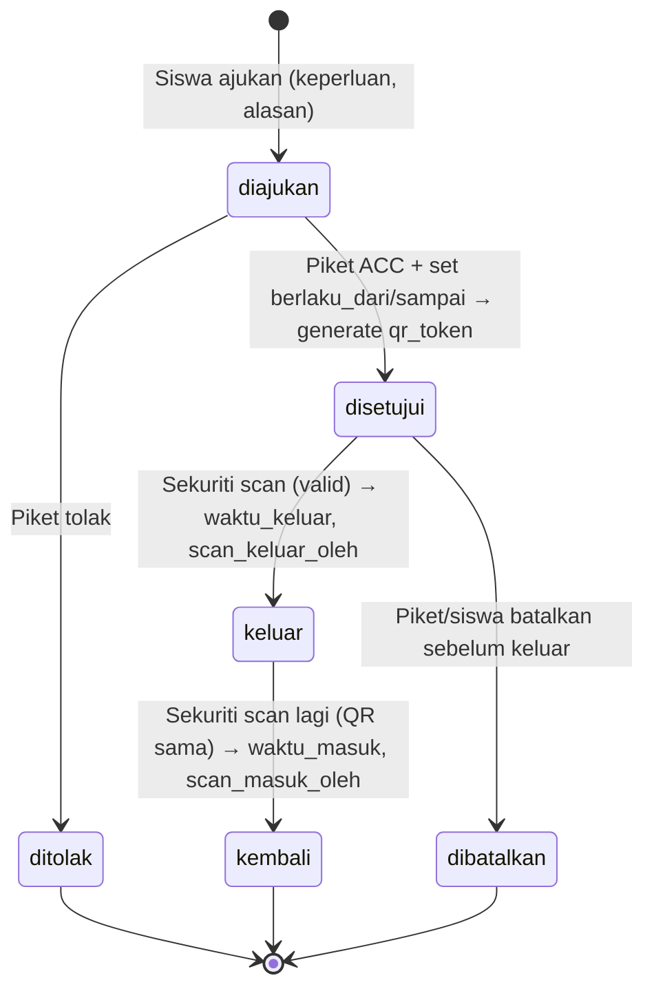
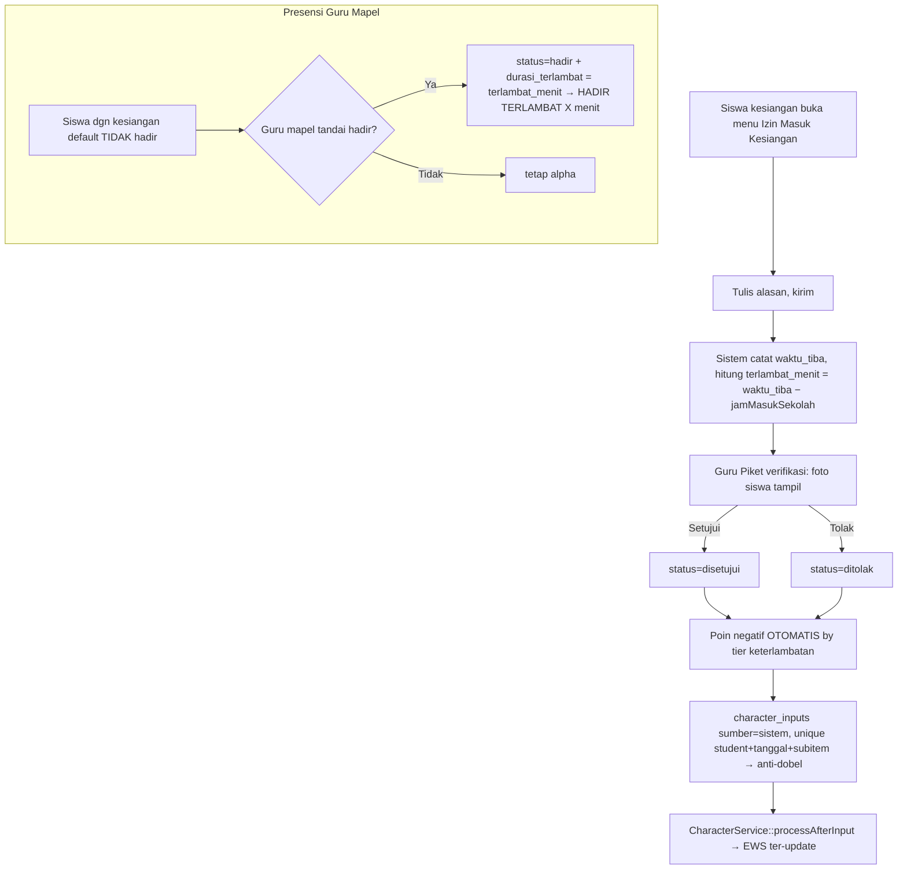

# Brief Pengembangan (RPD) — Modul Bel Sekolah + Piket Terintegrasi

**Proyek induk:** Aplikasi Agenda Pembelajaran Kelas — SMK Negeri 2 Cimahi
**Modul baru:** Bel Sekolah Dinamis, Piket Real-time, Izin Keluar berbasis QR, Izin Masuk Kesiangan
**Stack:** Laravel 11 (PHP 8.3) + MySQL 8 + React 18 + Vite + Tailwind (PWA), disk `public`/Cloudflare R2, FCM Push
**Status:** Brief untuk dikembangkan Claude Code
**Tanggal:** 22 Juli 2026
**Menggantikan:** `RPD-Bel-Sekolah-GAS.md` (versi Google Apps Script standalone) — kini **menyatu ke dalam aplikasi Agenda**, memakai data, otorisasi, storage, presensi, dan poin karakter yang sudah ada.

---

## 1. Ringkasan & Perubahan Paradigma

RPD lama (`RPD-Bel-Sekolah-GAS.md`) merancang sistem bel **berdiri sendiri** di Google Apps Script + Google Sheets. Brief ini menggantinya: seluruh fitur bel menjadi **modul di dalam aplikasi Agenda Pembelajaran** yang sudah berjalan, sehingga:

- **Tidak menduplikasi data** guru/kelas/jadwal/ruangan — sudah ada dari import aSc (`schedules`, `bell_periods`, dst).
- **Waktu bel = satu sumber kebenaran** yang sudah ada: `App\Support\BellSchedule::resolve()` (jam-ke → pukul, + mode Apel/Tanpa-Apel).
- **Presensi & poin karakter kesiangan menyatu** dengan `student_attendances` dan `character_inputs` yang sudah dipakai guru — bukan sistem terpisah.
- **Otorisasi mengikuti pola kapabilitas** (`App\Support\ClassAccess`), bukan cek role literal.
- **Storage & push mengikuti** disk `public`/R2 dan FCM yang sudah terpasang.

Empat kapabilitas baru yang ditambahkan modul ini:

1. **Bel Sekolah Dinamis** — bank audio + pemutar otomatis (kiosk) yang berbunyi sesuai jadwal & mode hari itu.
2. **Piket Real-time** — guru piket hari itu melihat bel berjalan (sebelumnya/berikutnya/hitung mundur), memproses izin, mengabsen, dan menulis Resume Piket. Guru yang tidak bertugas tidak melihat menu ini.
3. **Izin Keluar berbasis QR** — siswa mengajukan, piket menyetujui, siswa mendapat QR, sekuriti memindai saat keluar & masuk, semua tercatat & terpantau real-time oleh piket.
4. **Izin Masuk Kesiangan** — siswa terlambat mengajukan izin (diverifikasi piket dengan foto), status kehadiran menjadi "hadir terlambat X menit", dan **poin negatif otomatis** sesuai lama keterlambatan (tanpa dobel dengan poin manual guru).

---

## 2. Prinsip Integrasi (WAJIB diikuti)

Modul ini harus patuh pada konvensi arsitektur proyek. Setiap developer/agent WAJIB:

| Aspek | Aturan proyek | Referensi eksisting |
|---|---|---|
| Scoping tahun ajaran | Semua query operasional pakai scope `->tahunAjaran()` / `App\Support\TahunAjaran::id()` | `Schedule::scopeTahunAjaran`, `CharacterInput::booted` |
| Kunci semester | Penulisan berbasis kelas cek `App\Support\SemesterLock::assertClassWritable($classId)` | `PresensiController::bulkStore` |
| Tolak tanggal masa depan | Entri tanggal pakai trait `App\Traits\RejectsFutureDate` (BE) + `toLocalDateStr()` (FE) | `DailyAttendanceController` |
| Otorisasi kelas | Pakai `App\Support\ClassAccess` (kapabilitas), BUKAN cek `role === 'wali_kelas'` | `ClassAccess::teachingClassIds/pastoralClassIds` |
| Timezone tanggal | Selalu `Asia/Jakarta`; FE pakai `toLocalDateStr()` (jangan `toISOString()`) | `lib/utils.ts` |
| Waktu sesi | Jangan hitung jam sendiri — panggil `BellSchedule::resolve($schedule, $tanggal)` | `ScheduleController`, `ScheduleResource` |
| Export PDF | Trait `HandlesPdfPreview` / `ServesStoredPdf` + pola base64 anti-IDM | 15+ controller |
| Export Excel | Trait `BuildsXlsxReports` (border/kop/TTD standar) | `ReportController` |
| Gambar di PDF | `App\Support\ImageDataUri::forPublicDisk()` (portable lokal & R2) | `RekapPerkembangan`, EWS |
| Kompresi upload | `App\Support\FileCompressor::compress()` (GD gambar, Ghostscript PDF) | `RecommendationController` |
| Enum status | String lowercase; hindari em-dash & double-hyphen di string yang tampil ke user | `AttendanceStatus`, RPD GAS §10 |
| Idempotensi | `updateOrCreate` + unique index (pola `student_attendances`) | Presensi & DailyAttendance |
| Push | `PushSubscription` + `FcmSetting` (sudah jalan) | `PushSubscriptionController` |

---

## 3. Peran & Kapabilitas

### 3.1 Peran BARU: `sekuriti`
Aktor eksternal yang **hanya** memindai QR (keluar/masuk) dan melihat log-nya. Layak jadi **role baru** (bukan turunan guru).

Menambah role butuh 3 titik (pola sudah dipetakan):
1. Case `Sekuriti = 'sekuriti'` di `app/Enums/UserRole.php`.
2. Migration `ALTER` kolom enum `users.role` (kolom saat ini hard-enum) → tambah `'sekuriti'`.
3. Cabang di `frontend/src/components/layout/nav-config.ts` (`getNavForUser`) + rute di `router/index.tsx` + guard API (`role:sekuriti` via `EnsureRole`).

Admin membuat akun sekuriti lewat panel (mirip pembuatan user). Sekuriti tidak terikat kelas/TA.

### 3.2 Guru Piket = KAPABILITAS (bukan role baru)
Guru piket adalah **guru biasa yang ditugaskan piket pada tanggal tertentu**. Jangan buat role baru. Ikuti pola `pkl.is_pembimbing` / `kokurikuler.is_fasilitator`:

- Tabel `piket_assignments` menentukan siapa petugas pada tanggal/hari mana.
- `UserResource::computeKapabilitas()` menambah blok `piket` → `{ is_petugas_hari_ini: bool, tanggal, ids_assignment }`.
- Menu **Piket** di `nav-config.ts` muncul HANYA bila `user.piket?.is_petugas_hari_ini` → memenuhi "guru yang tidak bertugas tidak akan muncul ini".
- Semua endpoint piket diproteksi backend: cek `PiketAccess::isPetugas($user, $tanggal)` (helper baru bergaya `ClassAccess`), bukan sekadar nav.

> Catatan: satu hari bisa >1 guru piket (rows jamak). Semua petugas hari itu berbagi pandangan yang sama (izin, absensi, resume kolaboratif).

---

## 4. Model Data

### 4.1 Yang DIPAKAI ULANG (jangan dibuat baru)
- `bell_periods` (hari, jam_ke, jam_mulai, jam_selesai) — durasi jam pelajaran.
- `bell_modes` (nama, `offset_menit`, is_default) — **Apel = 0, Tanpa Apel = −60**.
- `bell_day_defaults` (hari → mode), `bell_mode_overrides` (tanggal → mode).
- `BellSchedule::resolve()` — pukul efektif sesi.
- `student_attendances` (status enum, **`durasi_terlambat` menit** sudah ada) — "hadir terlambat" = status `hadir` + `durasi_terlambat`.
- `daily_attendances` (student_id, class_id, tanggal, status, recorded_by; unique `(student_id, tanggal)`) — basis absensi harian piket.
- `character_inputs` + `character_subitems` (KD-04 "Terlambat masuk kelas" bobot −5) + `CharacterService::processAfterInput()`.
- `users.foto` — foto profil siswa untuk verifikasi identitas piket.
- `PushSubscription` / `FcmSetting` — notifikasi.

### 4.2 Tabel BARU

**Bel & audio**
1. `bell_audios` — bank suara: `id, uuid, nama, kategori(enum), disk, path, durasi_detik(nullable), ukuran_byte, uploaded_by, aktif, timestamps, softDeletes`.
   `kategori` enum: `masuk, pergantian, istirahat_mulai, istirahat_selesai, pulang, upacara, khusus, murottal, darurat`.
2. `bell_audio_maps` — pemetaan event → audio per mode: `id, bell_mode_id(nullable=berlaku semua mode), jenis_event(enum sama seperti kategori), bell_audio_id, aktif`.
   Resolusi audio suatu event: cari map spesifik mode dulu, lalu fallback map global (`bell_mode_id = null`).
3. `bell_periods` **ditambah kolom**: `is_istirahat(bool, default false)`, `terkunci_offset(bool, default false)`.
   `terkunci_offset = true` → periode ini **TIDAK bergeser** oleh `offset_menit` mode (jam dinding tetap). Dipakai untuk **istirahat break 15 menit setelah jam ke-4** dan **istirahat siang 12.00–13.00** agar tetap walau sekolah masuk lebih awal (lihat §5.1).
4. `bell_devices` (opsional) — kiosk pemutar: `id, uuid, nama, token, last_heartbeat_at, aktif`.
5. `bell_ring_logs` — log eksekusi bel: `id, tanggal, waktu, jenis_event, bell_audio_id, bell_device_id(nullable), status(enum berhasil/gagal/dilewati), keterangan, timestamps`.

**Piket**
6. `piket_assignments` — `id, academic_year_id, tanggal(date), teacher_id, dibuat_oleh, timestamps`. Unique `(academic_year_id, tanggal, teacher_id)`. (Alternatif recurring: kolom `hari` nullable untuk template mingguan → digenerate ke tanggal.)
7. `piket_resumes` — Resume Piket harian (seperti agenda): `id, academic_year_id, tanggal, teacher_id, ringkasan(text), kejadian_penting(text, nullable), timestamps`. Unique `(tanggal)` (satu resume gabungan per hari; petugas jamak menyunting bersama) atau `(tanggal, teacher_id)` bila ingin per petugas — **keputusan §12**.

**Izin Keluar**
8. `izin_keluars` — `id, uuid, academic_year_id, student_id, tanggal, keperluan, alasan(text), status(enum), diproses_oleh(teacher_id nullable), berlaku_dari(datetime nullable), berlaku_sampai(datetime nullable), qr_token(string unique, nullable), waktu_keluar(datetime nullable), scan_keluar_oleh(user_id nullable), waktu_masuk(datetime nullable), scan_masuk_oleh(user_id nullable), catatan_piket, timestamps`.
   `status` enum: `diajukan, disetujui, ditolak, keluar, kembali, dibatalkan`.
   Index: `(tanggal, status)`, `(student_id, tanggal)`.

**Izin Masuk Kesiangan**
9. `izin_kesiangans` — `id, uuid, academic_year_id, student_id, tanggal, alasan(text), status(enum diajukan/disetujui/ditolak), waktu_tiba(datetime), terlambat_menit(smallint), diverifikasi_oleh(teacher_id nullable), character_input_id(nullable, poin otomatis terkait), timestamps`. Unique `(student_id, tanggal)` (satu kesiangan per hari).

**Poin karakter otomatis (anti-dobel)**
10. `character_inputs` **ditambah kolom**: `sumber(enum: guru, sistem; default guru)`, `tanggal_kejadian(date, nullable)`, `poin_override(integer, nullable)`.
    - `sumber='sistem'` → poin = `poin_override` (proporsional keterlambatan), `teacher_id` boleh null.
    - **Unique parsial** `(student_id, tanggal_kejadian, subitem_id)` untuk baris `sumber='sistem'` (emulasi via `updateOrCreate` + unique index) → kesiangan hari sama tak menghasilkan poin ganda.
    - Guard di FE/BE: bila poin otomatis KD-04 sudah ada untuk (siswa, tanggal), guru diberi peringatan agar tidak memberi KD-04 manual lagi.
11. `kesiangan_point_tiers` (config) — `id, menit_min, menit_max(nullable), poin(integer negatif), aktif`. Menentukan besar poin per rentang keterlambatan (mis. `1–15 → −2`, `16–30 → −5`, `>30 → −10`). Dikelola admin.

---

## 5. Fitur Modul (alur end-to-end)

### 5.1 Fondasi Bel: Mode Apel/Tanpa-Apel + Istirahat Terkunci

**Yang sudah ada:** `bell_modes.offset_menit` menggeser SELURUH sesi. Apel = 0 (masuk 07.30), Tanpa Apel = −60 (masuk 06.30). Admin memilih mode per hari (`bell_day_defaults`) atau per tanggal (`bell_mode_overrides`).

**Tambahan wajib (kebutuhan user):** istirahat tetap walau start bergeser.
- Tandai periode istirahat sebagai `terkunci_offset = true`. Saat `BellSchedule::resolve()` menerapkan offset, periode terkunci **tidak digeser** — jam dinding tetap (break 15 menit setelah jam ke-4; istirahat siang 12.00–13.00).
- **Durasi jam pelajaran mengikuti `bell_periods`** (pengaturan Jam aplikasi) — tidak dihardcode.
- Konsekuensi model: saat masuk 06.30 (Tanpa Apel), blok pagi bergeser mundur namun istirahat tetap di jam dinding aslinya; jumlah jam sebelum istirahat tetap, hanya awalnya lebih pagi. Resolver harus menghitung sesi non-terkunci relatif terhadap awal-hari yang bergeser, lalu mengunci sesi istirahat pada jam absolut.

> Implementasi: perluas `BellSchedule::resolve()` — jika `schedule` memetakan ke periode `terkunci_offset`, kembalikan jam periode TANPA `shift($offset)`. Uji regresi wajib (mode Apel vs Tanpa Apel, istirahat tetap).

**Titik masuk sekolah (untuk hitung keterlambatan):** `BellSchedule::jamMasukSekolah($tanggal)` = jam mulai jam ke-1 pada mode tanggal itu (07.30 Apel / 06.30 Tanpa Apel). Dipakai modul kesiangan (§5.5).

### 5.2 Bank Audio & Pemutar (Kiosk)

**Admin — Bank Audio** (tab baru "Bel & Audio", perluasan tab "Jam & Bel"):
- Upload mp3/ogg → `Storage::disk('public')` folder `audio_bel/`, nama file **deterministik** `audio-{slug-nama}.mp3` (pelajaran dari fitur Jadwal PDF: jangan hash tak jelas). Validasi `mimetypes:audio/mpeg,audio/ogg`, `max:5120` (5MB). Tanpa kompresi (audio pass-through di `FileCompressor`).
- Kategorisasi (enum §4.2), preview inline (HTML `<audio>`), soft delete + restore, replace tanpa ganti id.
- **Pemetaan event → audio** (`bell_audio_maps`) per mode: bel masuk pertama, pergantian jam, istirahat mulai/selesai, pulang, upacara. Fallback global bila mode tak punya map khusus.

**Pemutar (kiosk `/bel/pemutar`):**
- Halaman perangkat (di PC/HP tersambung speaker). Registrasi `bell_devices` + token; heartbeat tiap 30–60 dtk (`bell_ring_logs`/status device).
- Ambil "jadwal bunyi hari ini" (event + waktu, dari `bell_periods` + mode + `bell_audio_maps`). Loop lokal 1 dtk; sinkron server tiap 60 dtk.
- **Web Audio API** + Page Visibility API (anti sleep/throttle). Anti-duplikasi: satu event satu kali per slot. Preload audio berikutnya 60 dtk sebelum. Autoplay perlu 1 gestur awal (tombol "Aktifkan Suara").
- Bel manual/darurat (konfirmasi dua tahap). Setiap bunyi → `bell_ring_logs`.
- Best-practice cPanel: **tanpa websocket** (rawan 508). Kiosk cukup polling ringan + cache jadwal hari ini.

### 5.3 Piket: Dashboard Real-time

Menu **Piket** (`/piket`) muncul hanya untuk petugas hari itu. Isi:

1. **Bel berjalan (real-time):** daftar bel hari ini, sorot **sedang berlangsung**, **berikutnya** (hitung mundur menit:detik), **sebelumnya apa**. Data dari `BellSchedule` + mode hari itu. Refresh tiap 5–10 dtk (polling ringan) + tick lokal 1 dtk. Menjawab: "guru piket bisa melihat waktu bel real time berikutnya sebelumnya apa".
2. **Izin Keluar** — daftar pengajuan (approve/tolak + set masa berlaku QR) & **log keluar/masuk real-time** (§5.4).
3. **Izin Masuk Kesiangan** — daftar verifikasi (foto siswa tampil) (§5.5).
4. **Absensi Harian** — absen manual seluruh kelas (pola `daily_attendances`, tap-cycle seperti presensi guru), menandai yang izin keluar/kesiangan.
5. **Resume Piket** — form ringkasan + kejadian penting (seperti resume agenda). Export PDF/Excel (`HandlesPdfPreview` + `BuildsXlsxReports`); foto bukti opsional via `ImageDataUri::forPublicDisk`.

### 5.4 Izin Keluar berbasis QR (siswa → piket → sekuriti)

**Aktor:** Siswa (ajukan), Guru Piket (setujui + set masa berlaku), Sekuriti (pindai keluar & masuk).

**Aturan kunci:**
- **QR unik per (siswa, izin).** `qr_token` = string acak + ditandatangani HMAC server (payload: `izin.uuid|student.uuid|nonce`). Ditampilkan di akun siswa via `qrcode.react`. **Tidak bisa dipakai berdua** — token terikat satu izin, satu siswa, sekali siklus keluar→masuk.
- **Masa berlaku ditetapkan guru piket** (`berlaku_dari`/`berlaku_sampai`). Di luar rentang → scan ditolak.
- **Sekuriti memindai lewat kamera HP** (`html5-qrcode`). Endpoint `POST /sekuriti/scan {qr_token}` memvalidasi: signature sah → izin `disetujui`/`keluar` → dalam rentang berlaku → transisi status benar (tak bisa keluar dua kali). Balas identitas siswa + foto + arah (keluar/masuk) untuk konfirmasi visual sekuriti.
- **Tercatat & real-time ke piket:** setiap scan meng-update izin; dashboard piket memantau "keluar jam berapa, kembali jam berapa, dipindai sekuriti siapa". Push FCM ke piket saat ada scan.
- Kamera butuh **HTTPS** (PWA produksi sudah HTTPS).

### 5.5 Izin Masuk Kesiangan + Presensi + Poin Otomatis

Alur paling kompleks — menyatukan izin, presensi guru mapel, dan poin karakter otomatis.

**Aturan kunci (sesuai permintaan user):**
1. **Keterlambatan dihitung dari jam masuk sekolah** (`BellSchedule::jamMasukSekolah($tanggal)`, sadar Apel/Tanpa-Apel: 07.30 / 06.30). `terlambat_menit = waktu_tiba − jam_masuk`.
2. **Verifikasi piket menampilkan foto siswa** (`users.foto`) untuk memastikan identitas. (Default pakai foto profil; opsi lampiran selfie terkompresi `FileCompressor` = §12.)
3. **Presensi tidak bisa "hadir" polos untuk siswa kesiangan.** Di form presensi guru mapel: siswa yang punya rekaman kesiangan hari itu **default tidak hadir** (guru wajib menyatakan tidak hadir lebih dulu). Bila guru menandai hadir, sistem menyimpan `status=hadir` + `durasi_terlambat = izin_kesiangan.terlambat_menit` → tampil **"Hadir terlambat X menit"**. Berlaku baik saat izin disetujui maupun tidak (perbedaannya: disetujui = berizin/excused, ditolak/none = tanpa izin) — status tetap hadir-terlambat.
4. **Poin negatif otomatis, sekali, proporsional:** saat kesiangan tercatat, sistem membuat `character_inputs` `sumber='sistem'`, `subitem = KD-04` (Terlambat), `sign=negatif`, `poin_override = kesiangan_point_tiers(terlambat_menit)`, `tanggal_kejadian = tanggal`. **Anti-dobel** via unique `(student_id, tanggal_kejadian, subitem_id)` + `updateOrCreate`. Lalu panggil `CharacterService::processAfterInput()`.
5. **Cegah dobel dengan poin manual guru:** jika poin otomatis KD-04 sudah ada untuk (siswa, tanggal), guru diberi peringatan di UI karakter agar tidak memberi pelanggaran "terlambat" yang sama. (Guru tetap boleh input pelanggaran lain.)

**Hook implementasi:** buat/verifikasi kesiangan → service `KesianganService::terapkanPoin($izin)` (analog `AlphaAlertService`), dipanggil dari `IzinKesianganController` saat status final. Presensi: tambahkan pengecekan di `PresensiController::bulkStore` — bila siswa punya kesiangan hari itu & guru set `hadir`, override `durasi_terlambat` (jangan timpa bila guru isi manual lebih besar; keputusan §12).

---

## 6. Kontrak API (ringkas)

Prefiks `/api/v1`. Semua diproteksi Sanctum + guard kapabilitas.

**Admin — Bel & Audio**
- `GET/POST/PUT/DELETE /admin/bell-audios` — CRUD bank audio (upload multipart).
- `GET/PUT /admin/bell-audio-maps` — pemetaan event→audio per mode.
- `PUT /admin/bell-periods` (perluas existing) — set `is_istirahat`, `terkunci_offset`.
- `GET/PUT /admin/kesiangan-tiers` — tier poin keterlambatan.
- `POST /admin/piket/assignments`, `POST /admin/piket/import` (Excel daftar guru piket), `GET /admin/piket/assignments`.
- CRUD akun `sekuriti` lewat modul user admin yang ada.

**Kiosk pemutar**
- `GET /bel/hari-ini?device_token=` — event bunyi + audio URL hari ini.
- `POST /bel/heartbeat`, `POST /bel/ring-log`, `POST /bel/manual` (darurat, audit).

**Piket** (guard `PiketAccess::isPetugas`)
- `GET /piket/ringkasan` — bel real-time + counter izin + absensi.
- `GET /piket/izin-keluar`, `POST /piket/izin-keluar/{uuid}/proses` (setujui/tolak + berlaku), `GET /piket/izin-keluar/log`.
- `GET /piket/kesiangan`, `POST /piket/kesiangan/{uuid}/verifikasi`.
- `GET/POST /piket/absensi` (bulk upsert `daily_attendances`).
- `GET/POST /piket/resume`, `GET /piket/resume/export?format=pdf|xlsx` (preview base64 anti-IDM).

**Siswa**
- `POST /izin-keluar`, `GET /izin-keluar/aktif` (menampilkan QR bila disetujui).
- `POST /izin-kesiangan`, `GET /izin-kesiangan/hari-ini`.

**Sekuriti** (guard `role:sekuriti`)
- `POST /sekuriti/scan {qr_token}` — validasi + transisi keluar/masuk, balas identitas+foto+arah.
- `GET /sekuriti/log` — riwayat scan hari itu.

---

## 7. Frontend: Halaman & Navigasi

Tambah di `router/index.tsx` (dalam `AppLayout`) + daftarkan di `nav-config.ts` `getNavForUser`:

| Halaman | Route | Terlihat oleh |
|---|---|---|
| Bel & Audio (admin) | `/admin` tab "Bel & Audio" | admin |
| Pemutar Bel (kiosk) | `/bel/pemutar` | perangkat (token; publik terbatas) |
| Piket (dashboard) | `/piket` | `user.piket?.is_petugas_hari_ini` |
| Izin Keluar (siswa) | `/izin-keluar` | siswa |
| Izin Kesiangan (siswa) | `/izin-kesiangan` | siswa |
| Pemindai Sekuriti | `/sekuriti/scan` | `role === 'sekuriti'` |

- Gating mengikuti pola mode `pkl`/`kokurikuler` (flag di `UserResource.kapabilitas`).
- Komponen QR: `qrcode.react` (tampilkan di akun siswa). Pemindai: `html5-qrcode` (sekuriti). Keduanya **belum terpasang** → tambah ke `frontend/package.json`.
- Absensi & presensi kesiangan reuse komponen `PresensiToggleList` (tap-cycle) demi konsistensi & kecepatan (filosofi ≤2 menit).
- Mobile-first: kartu 1 kolom di HP (pelajaran dari layout responsif Jadwal Saya), toolbar `flex-wrap`.

---

## 8. Keputusan Storage & QR (teraman & teringan)

**Audio & foto → `Storage::disk('public')`.** Ini titik konfigurasi tunggal yang **otomatis pindah ke Cloudflare R2** bila admin mengaktifkan Penyimpanan R2 — tanpa ubah kode. Rekomendasi:
- **Audio (`audio_bel/`):** untuk sekolah dengan banyak/berat audio, **aktifkan R2** agar bandwidth tak membebani hosting cPanel (rawan 508). Nama file deterministik (`audio-{slug}.mp3`), bukan hash. Disajikan via URL disk (R2 = signed `temporaryUrl`; lokal = URL langsung).
- **Foto kesiangan:** default cukup **foto profil siswa** (`users.foto`) yang sudah ada — **tanpa upload baru** (paling ringan). Bila butuh selfie bukti, simpan `foto_izin_kesiangan/` lewat `FileCompressor::compress()` (GD auto resize 1600px + JPG q75).
- **File privat** idealnya disk `local` (`storage/app/private`), namun trait serving saat ini pakai `public`; untuk konsistensi awal pakai `public`, evaluasi privatisasi log izin nanti.

**QR — dependensi minimal:**
- **Generate:** cukup **frontend `qrcode.react`** (render dari `qr_token`). Backend hanya menandatangani token HMAC (tanpa library QR).
- **Scan:** **frontend `html5-qrcode`** (atau `@zxing/library`) di halaman sekuriti (kamera HP, HTTPS).
- **QR di PDF** (opsional, mis. verifikasi resume): tambah backend `endroid/qr-code` → PNG data-URI di-embed via pola `ImageDataUri`. Hanya jika diperlukan.

---

## 9. Real-time, Performa & cPanel

- **Strategi real-time = polling ringan + FCM push**, BUKAN websocket (cPanel rawan HTTP 508 & tak ramah socket).
  - Dashboard piket & log scan: poll 5–10 dtk (payload kecil, tanpa `per_page=all`).
  - Kiosk bel: cache jadwal hari ini (server) + tick lokal 1 dtk + sinkron 60 dtk.
  - Notifikasi kejadian (izin baru, scan keluar/masuk, kesiangan): **FCM push** ke akun terkait (infra sudah ada).
- Hindari `per_page=all` pada endpoint list (pelajaran insiden 508). Paginasi/scope tanggal.
- Cache statis (BellSchedule) sudah punya `flush()` — panggil setelah ubah bel; wajib di test.

---

## 10. Keamanan & Kepatuhan (UU PDP 27/2022)

- **QR anti-pemalsuan & anti-berbagi:** token acak + HMAC server; terikat (izin, siswa); masa berlaku sempit; transisi status sekali jalan; scan divalidasi server (jangan percaya payload QR mentah).
- **Otorisasi berlapis:** nav visibility + guard API kapabilitas (`PiketAccess`, `role:sekuriti`) + scope TA. Sekuriti hanya boleh endpoint scan/log.
- **Data pribadi siswa** (foto, alasan izin, log keluar-masuk, poin) = data sensitif: akses dibatasi peran, audit lewat `AuditLog`, retensi log wajar. Tampilkan foto hanya pada layar piket/sekuriti saat verifikasi.
- **Poin otomatis transparan & bisa dikoreksi:** siswa/wali bisa melihat asal poin (`sumber=sistem`); sediakan jalur koreksi manual bila keterlambatan keliru (mis. gangguan sistem).

---

## 11. Migrasi Database (ringkas, aditif & aman)

1. `ALTER users.role` enum + `sekuriti`.
2. `create bell_audios`, `bell_audio_maps`, `bell_devices`, `bell_ring_logs`.
3. `ALTER bell_periods` + `is_istirahat`, `terkunci_offset`.
4. `create piket_assignments`, `piket_resumes`.
5. `create izin_keluars`, `izin_kesiangans`.
6. `ALTER character_inputs` + `sumber`, `tanggal_kejadian`, `poin_override` + unique parsial `(student_id, tanggal_kejadian, subitem_id)`.
7. `create kesiangan_point_tiers` + seeder default (mis. `1–15→−2, 16–30→−5, >30→−10`).

Semua aditif (tidak menghapus data). Setelah deploy: `Migrate` (auto-backup), lalu `schema:snapshot` + commit. dist.zip rebuild (ada perubahan FE).

---

## 12. Keputusan yang Perlu Ditegaskan User (sebelum coding)

1. **Poin saat izin kesiangan DISETUJUI:** tetap kena poin negatif (sesuai "setiap kesiangan otomatis poin"), atau izin yang sah (mis. alasan keluarga) **membebaskan** poin? (Default brief: tetap kena; approval hanya soal status kehadiran.)
2. **Resume Piket:** satu resume gabungan per hari (petugas jamak menyunting bersama) atau satu per petugas?
3. **Absensi piket vs presensi guru mapel:** apakah absensi harian piket menimpa/menyatu dengan `daily_attendances` wali kelas, atau tabel sendiri? (Default: pakai `daily_attendances`, `recorded_by` = piket.)
4. **Re-entry izin keluar:** cukup dipindai sekuriti, atau perlu konfirmasi piket juga saat masuk?
5. **Foto kesiangan:** cukup foto profil, atau siswa wajib unggah selfie saat itu?
6. **Guru menandai hadir siswa kesiangan:** `durasi_terlambat` selalu ikut hitungan sistem, atau guru boleh menyesuaikan?
7. **Tier poin keterlambatan:** angka rentang & poin final (butuh dari kurikulum/kesiswaan).

---

## 13. Roadmap Sprint (untuk Claude Code)

| Sprint | Fokus | Deliverable |
|---|---|---|
| S1 | Fondasi bel | `bell_periods.terkunci_offset` + istirahat tetap, `BellSchedule::jamMasukSekolah`, uji regresi Apel/Tanpa-Apel |
| S2 | Bank audio + pemutar | `bell_audios`/`bell_audio_maps`, admin CRUD, kiosk `/bel/pemutar` (Web Audio, heartbeat, log) |
| S3 | Peran & piket dasar | role `sekuriti`, `piket_assignments` + import Excel, kapabilitas `piket`, dashboard bel real-time |
| S4 | Izin keluar + QR | state machine, `qrcode.react`, halaman sekuriti `html5-qrcode`, `POST /sekuriti/scan`, log real-time piket |
| S5 | Kesiangan + poin + presensi | `izin_kesiangans`, verifikasi foto, `character_inputs.sumber` + anti-dobel, integrasi `PresensiController` hadir-terlambat |
| S6 | Absensi & Resume Piket | absensi harian piket (`daily_attendances`), Resume Piket + export PDF/Excel |
| S7 | Notifikasi & polish | FCM push (izin/scan/kesiangan), mobile polish, dashboard analitik piket |
| S8 | Uji menyeluruh & deploy | uji 7 peran × 2 viewport, matriks keamanan curl, snapshot skema, dist.zip, Catatan Rilis |

Kembangkan **satu sprint per iterasi, minta konfirmasi** sebelum lanjut (pola RPD GAS §10). Setiap fitur wajib uji (Feature test PHP + Vitest) dan patuh konvensi §2.

---

## 14. Kriteria Penerimaan

1. Mode Tanpa-Apel memajukan masuk ke 06.30 **tanpa** menggeser istirahat (break jam-4 & 12.00–13.00 tetap). Terverifikasi test.
2. Kiosk membunyikan bel sesuai jadwal & mode, selisih ≤ 3 dtk, stabil ≥ 12 jam tanpa reload; anti-duplikasi.
3. Menu Piket hanya muncul bagi petugas hari itu; guru lain tidak melihatnya (nav + guard API).
4. Siswa mengajukan izin keluar → piket ACC → QR muncul → sekuriti scan keluar & masuk → log lengkap terpantau piket real-time; QR tidak bisa dipakai siswa lain / di luar masa berlaku.
5. Kesiangan → verifikasi piket (foto tampil) → status "hadir terlambat X menit" saat guru mapel menandai hadir → poin negatif otomatis **sekali**, proporsional, tak dobel dengan poin manual → EWS ter-update.
6. Semua entri menolak tanggal masa depan, discope TA aktif, dan menghormati `SemesterLock`.
7. Audio & foto tersimpan di disk `public`/R2 tanpa perubahan kode saat R2 diaktifkan; nama file jelas (bukan hash).
8. Tidak ada endpoint yang memakai `per_page=all`; dashboard real-time via polling ringan + FCM (tanpa websocket).

---

## 15. Catatan untuk Claude Code

1. Mulai dari Sprint 1, konfirmasi tiap sprint. Selesaikan **Keputusan §12** bersama user sebelum sprint terkait.
2. Label UI Bahasa Indonesia; hindari em-dash & double-hyphen pada string yang tampil ke user.
3. Ikuti **§2 Prinsip Integrasi** tanpa kecuali — terutama `BellSchedule`, `ClassAccess`, `TahunAjaran`, `SemesterLock`, `RejectsFutureDate`, `updateOrCreate`+unique, `HandlesPdfPreview`/`BuildsXlsxReports`, `FileCompressor`, `ImageDataUri`.
4. Reuse enum `AttendanceStatus` (`hadir/sakit/izin/alpha`) & kolom `durasi_terlambat` yang sudah ada — jangan bikin status "terlambat" baru.
5. Poin otomatis: `sumber='sistem'` + `poin_override` + unique parsial; SELALU panggil `CharacterService::processAfterInput()` setelah insert (agar threshold & EWS ikut).
6. Verifikasi FE dengan `tsc -b` (bukan `tsc --noEmit`) + Vitest; verifikasi BE di container MySQL (WSL tanpa driver MySQL). Kamera QR uji di HTTPS.
7. Setelah selesai: `Migrate` (auto-backup) → `schema:snapshot` commit → rebuild `dist.zip` → Catatan Rilis.

---

**Lampiran yang perlu dari user:**
- Daftar file audio bel yang sudah dimiliki (mp3) + pemetaan kategori.
- Jadwal periode istirahat pasti (konfirmasi: break 15 menit setelah jam ke-4; istirahat siang 12.00–13.00).
- Tabel tier poin keterlambatan (rentang menit → poin) dari Kesiswaan.
- Daftar guru piket (template Excel: tanggal/hari → guru) & daftar petugas sekuriti.
- Jawaban Keputusan §12.
