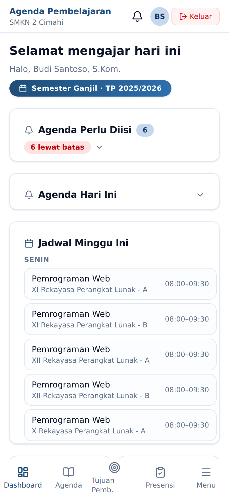

# Pendahuluan

## Tentang Aplikasi

Aplikasi Agenda Pembelajaran Kelas adalah platform administrasi pembelajaran SMK Negeri 2
Cimahi yang menyatukan tiga hal yang selama ini terpisah:

1. **Agenda pembelajaran harian** — apa yang diajarkan, kepada siapa, dan bagaimana hasilnya.
2. **Penilaian karakter berbasis poin** — seluruh guru yang mengajar menjadi observer karakter,
   memberi apresiasi (+) atau mencatat pelanggaran (−) dengan bobot yang terstandar.
3. **Sistem Peringatan Dini (EWS)** — sistem mengkorelasikan kehadiran, catatan KBM, nilai, dan
   poin karakter, lalu memunculkan peringatan sebelum masalah siswa membesar.

Prinsip yang memandu seluruh rancangan aplikasi:

> *"Setiap detik administratif yang dihemat dari guru adalah investasi untuk kualitas pembelajaran."*

Karena itu pengisian agenda inti dirancang selesai dalam **≤ 2 menit**, absensi satu kelas
**≤ 90 detik**, dan satu input poin karakter **≤ 20 detik**.

## Peran Pengguna

Aplikasi mengenal tujuh peran. Menu yang tampil di sisi kiri layar berbeda untuk tiap peran.

| Peran | Ringkasan wewenang |
|---|---|
| **Admin** | Mengelola seluruh data master, tahun ajaran, integrasi, backup, dan pemeliharaan sistem |
| **Wakasek Kurikulum** | Memantau EWS siswa & guru, laporan, rekap perkembangan lintas semester |
| **Guru** | Mengisi agenda, presensi sesi, menilai karakter, mengajukan guru inval, mencetak laporan, beban mengajar |
| **Wali Kelas** | Semua wewenang Guru + presensi harian, EWS kelas perwalian, data siswa, penanganan, refleksi mingguan |
| **Guru BK** | EWS murid yang diampu, konseling, riwayat dokumen penanganan |
| **Pembimbing PKL** | (saat Mode PKL aktif) agenda PKL mingguan & absen siswa bimbingan lintas kelas |
| **Fasilitator Kokurikuler** | (saat ada projek berjalan) absen peserta, laporan fasilitasi, nilai dimensi |
| **Siswa** | Melihat dashboard pribadi dan jadwal pelajaran |
| **Orang Tua** | Melihat dashboard perkembangan anak |

**Penting:** *Wali Kelas* dan *BK* bukan peran tersendiri, melainkan **kapabilitas** yang
menempel pada akun berperan *Guru*.

- Kapabilitas **Wali Kelas** aktif otomatis ketika akun guru ditetapkan sebagai wali kelas pada
  sebuah kelas di tahun ajaran yang sedang aktif.
- Kapabilitas **BK** aktif ketika Admin menandai guru tersebut sebagai guru BK.

Seorang guru bisa memegang keduanya sekaligus. Dalam kasus itu, sidebar akan menampilkan dua
kelompok menu terpisah: *Menu Wali Kelas* dan *Menu BK*.

Dengan cara yang sama, dua kapabilitas berbasis kegiatan bisa muncul sementara:

- Menu **PKL** muncul untuk guru **pembimbing PKL** saat Admin mengaktifkan *Mode PKL* (khusus
  kelas XII yang sedang praktik kerja lapangan). Lihat *Modul Guru → PKL*.
- Menu **Kokurikuler** muncul untuk guru **fasilitator** selama ada projek kokurikuler yang
  berjalan. Lihat *Modul Guru → Kokurikuler*.

## Cara Kelas Ditulis

Di seluruh aplikasi dan dokumen, nama kelas ditulis dengan format **`TINGKAT KODE ROMBEL`**,
misalnya **`XII RPL A`**, **`XI MEKA B`**, atau **`X ANIMASI C`**. Kode diambil dari singkatan
Program Keahlian (RPL, DKV, MEKA, ANIMASI, TKI, TP). Saat mengimpor data yang memuat kolom kelas,
Anda boleh menuliskan kode (mis. `XII RPL A`) maupun nama jurusan lengkap (`XII Rekayasa
Perangkat Lunak A`) — keduanya dikenali.

## Konvensi Penulisan

| Notasi | Arti |
|---|---|
| **Tebal** | Nama tombol, menu, atau tab yang harus diklik |
| `Kode` | Nilai yang diketik apa adanya, nama berkas, atau alamat halaman |
| → | Urutan navigasi, contoh: **Panel Admin** → tab **Guru** |
| ⚠️ | Peringatan: tindakan sulit dibatalkan atau berdampak luas |
| 💡 | Tips mempercepat pekerjaan |

## Perangkat yang Didukung

Aplikasi berbentuk **PWA (Progressive Web App)** dan berjalan di peramban mana pun yang
mutakhir — Chrome, Edge, Firefox, atau Safari — baik di komputer maupun telepon genggam.

Di telepon genggam, menu sidebar berubah menjadi navigasi bawah, dan menu yang tidak muat
dipindahkan ke tombol **Menu**.

Aplikasi dapat dipasang ke layar utama telepon melalui menu peramban **Tambahkan ke Layar
Utama**, sehingga terbuka seperti aplikasi biasa tanpa bilah alamat.

## Catatan Perlindungan Data

Seluruh tangkapan layar dalam panduan ini diambil dari basis data demo berisi **nama fiktif**.
Tidak ada data siswa atau guru sebenarnya yang ditampilkan, sesuai amanat UU Pelindungan Data
Pribadi No. 27 Tahun 2022.
