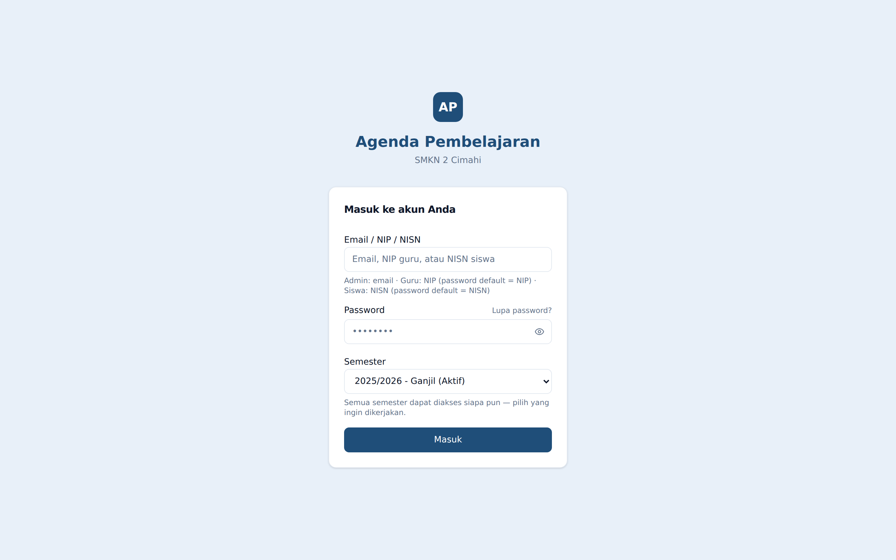
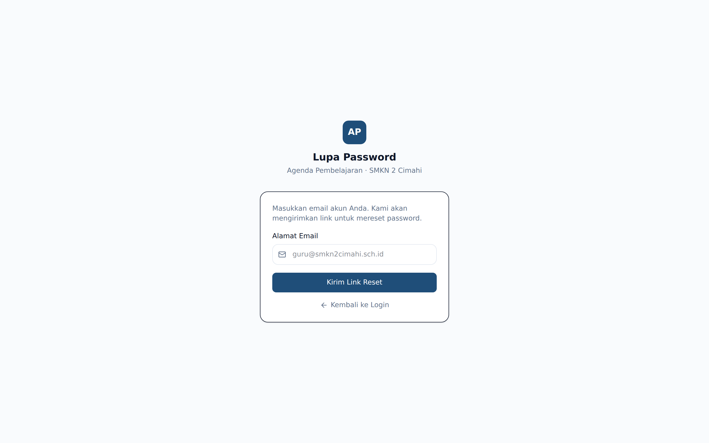
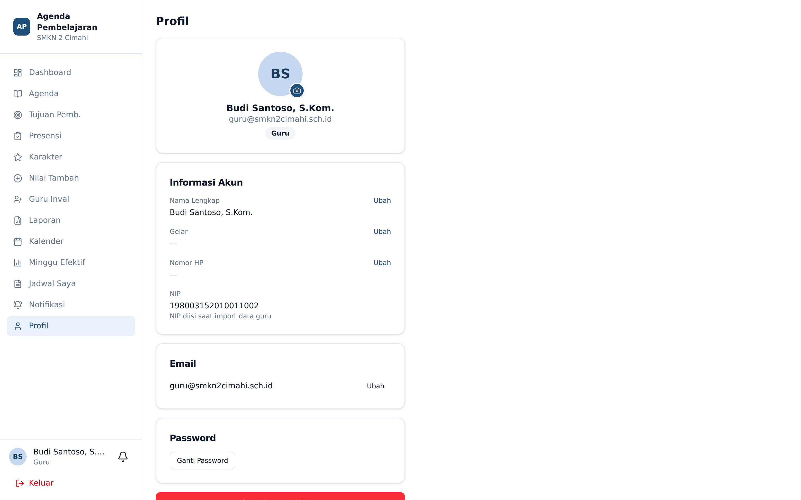
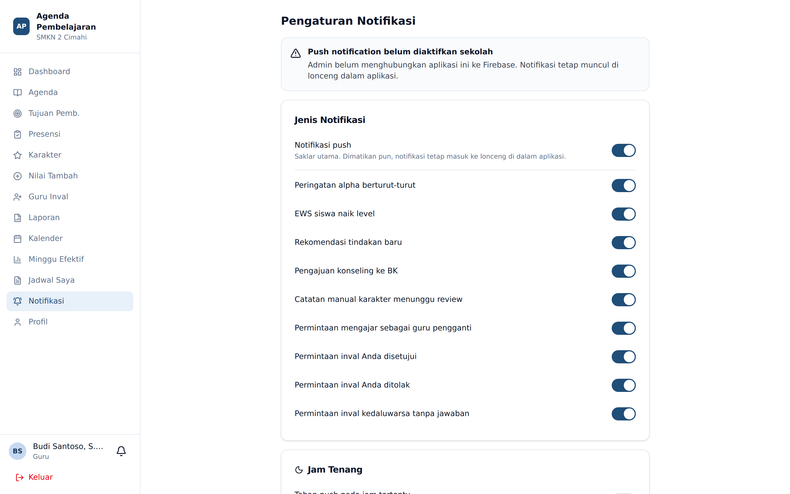

# Memulai

## Masuk ke Aplikasi

Buka alamat aplikasi di peramban. Halaman pertama yang muncul adalah halaman masuk.

Isi tiga bagian berikut:

1. **Identitas** — kolom ini menerima tiga bentuk identitas, pilih salah satu:
   - Alamat surel (semua peran), contoh `nama@smkn2cimahi.sch.id`
   - **NIP** (khusus guru)
   - **NISN** (khusus siswa)
2. **Password** — ketuk ikon mata untuk menampilkan kata sandi bila ragu.
3. **Semester** — pilih tahun ajaran dan semester yang akan Anda kerjakan.

Lalu tekan **Masuk**.

⚠️ Pilihan semester menentukan seluruh data yang Anda lihat dan ubah sesudahnya: jadwal,
agenda, presensi, poin karakter, dan EWS. Jika data terasa "hilang", periksa lebih dulu
apakah Anda sedang berada di semester yang benar. Nama semester aktif selalu ditampilkan
sebagai lencana biru di bagian atas dashboard.

Untuk berpindah semester tanpa keluar dari aplikasi, buka halaman **Pilih Tahun Ajaran**
melalui alamat `/pilih-tahun-ajaran`.

## Lupa Password

Tekan tautan **Lupa password?** pada halaman masuk.

Masukkan alamat surel akun Anda. Sistem mengirimkan tautan penyetelan ulang yang berlaku
terbatas. Buka tautan itu dari kotak masuk surel, lalu tentukan kata sandi baru.

Bila surel tidak kunjung tiba, periksa folder spam. Jika tetap tidak ada, hubungi Admin —
Admin dapat menyetel ulang kata sandi Anda dari **Panel Admin** → tab **Pengguna**.

## Halaman Profil

Menu **Profil** ada di paling bawah sidebar untuk semua peran.

Di sini Anda dapat:

| Bagian | Yang dapat diubah |
|---|---|
| **Informasi Akun** | Nama, nomor HP, foto profil. Khusus guru: **gelar depan** dan **gelar belakang** yang dipakai pada tanda tangan laporan |
| **Email** | Ganti alamat surel — wajib memasukkan kata sandi sebagai konfirmasi |
| **Password** | Ganti kata sandi — wajib memasukkan kata sandi lama |

💡 Isi gelar depan dan belakang dengan benar sejak awal. Nilai inilah yang tercetak pada blok
tanda tangan setiap laporan PDF yang Anda hasilkan.

## Notifikasi

Menu **Notifikasi** mengatur bagaimana aplikasi menghubungi Anda.

Tersedia tiga kelompok pengaturan:

1. **Jenis Notifikasi** — nyalakan atau matikan notifikasi push secara keseluruhan, lalu pilih
   jenis peristiwa mana yang ingin Anda terima (misalnya agenda yang belum diisi, eskalasi EWS,
   atau pengajuan guru inval).
2. **Perangkat Terdaftar** — daftar peramban dan telepon yang pernah Anda izinkan menerima
   notifikasi. Anda dapat **mencabut** perangkat yang sudah tidak dipakai.
3. **Jam Tenang** — rentang jam ketika notifikasi ditahan, misalnya `21:00`–`05:00`.

Saat pertama kali masuk, sebuah spanduk ajakan akan muncul di atas dashboard meminta izin
notifikasi. Izin ini diberikan oleh peramban, bukan oleh aplikasi. Jika Anda pernah menekan
**Blokir**, izin harus dipulihkan dari pengaturan situs pada peramban.

Notifikasi yang tiba ketika aplikasi sedang terbuka tampil sebagai kartu di dalam aplikasi,
bukan sebagai notifikasi sistem operasi.

## Keluar

Tombol **Keluar** berwarna merah di sudut kiri bawah sidebar. Pada telepon genggam, tombol ini
berada di dalam tombol **Menu**.
