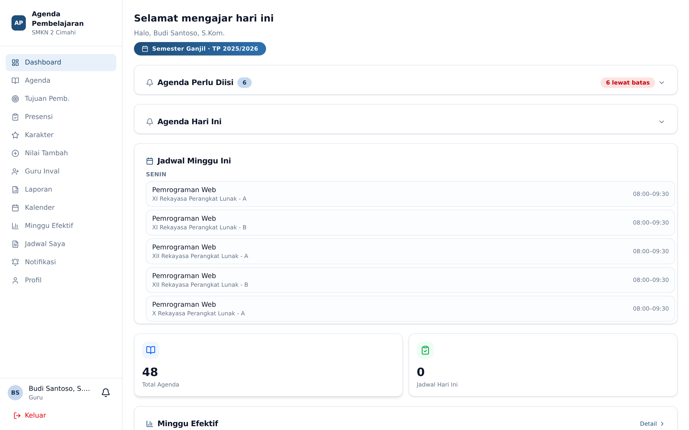
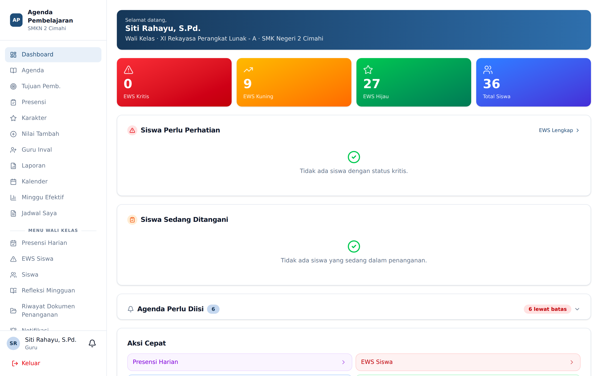
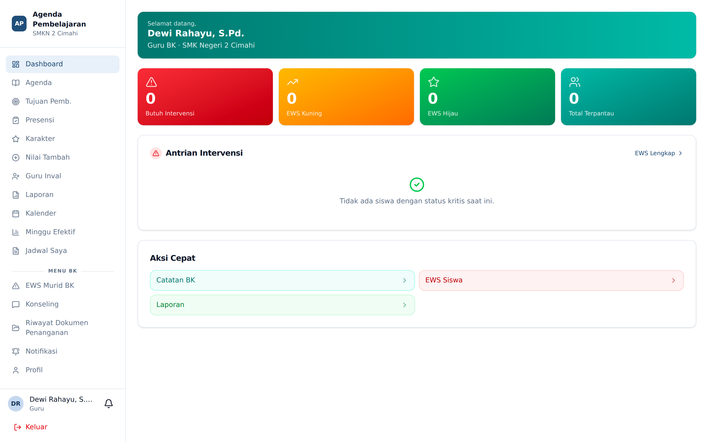
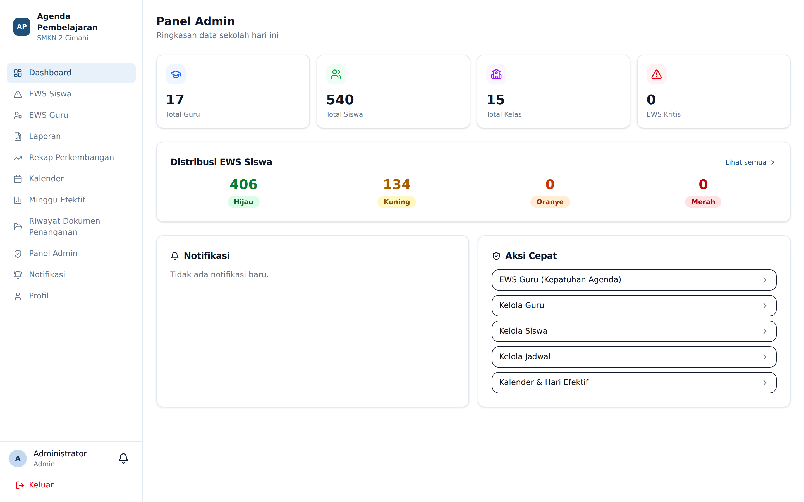

# Dashboard

Dashboard adalah halaman pertama sesudah masuk. Isinya menyesuaikan peran Anda.

## Dashboard Guru

Empat blok utama, berurutan dari yang paling mendesak:

1. **Agenda Perlu Diisi** — jadwal mengajar yang agendanya belum terisi, termasuk yang sudah
   **lewat batas** waktu pengisian. Lencana merah menunjukkan jumlah yang telat. Klik salah satu
   baris untuk langsung membuka formulir pengisian agenda.
2. **Agenda Hari Ini** — jadwal Anda pada tanggal berjalan.
3. **Jadwal Minggu Ini** — seluruh jadwal mengajar dikelompokkan per hari.
4. **Kartu ringkasan** — total agenda yang pernah Anda isi dan jumlah jadwal hari ini,
   diikuti ringkasan **Minggu Efektif**.

⚠️ Blok *Agenda Perlu Diisi* tidak dibatasi hanya hari ini. Jadwal dari minggu-minggu sebelumnya
yang agendanya belum diisi akan tetap muncul di sini sampai Anda isi.

## Dashboard Wali Kelas

Selain seluruh blok milik guru, wali kelas mendapat tambahan:

- **Siswa Sedang Ditangani** — daftar siswa di kelas perwalian yang penanganannya belum ditutup,
  lengkap dengan **umur kasus** (berapa lama kasus dibiarkan terbuka).
- **Ringkasan EWS kelas** — sebaran siswa per tingkat peringatan.

## Dashboard Guru BK

Menampilkan ringkasan murid dampingan BK, kasus konseling yang berjalan, serta eskalasi yang
dikirim wali kelas kepada BK.

## Dashboard Admin & Wakasek

Menampilkan angka agregat sekolah: jumlah guru, siswa, kelas, jadwal, agenda terisi, dan
ringkasan tingkat EWS seluruh sekolah.

## Dashboard Siswa

Menampilkan rekap kehadiran pribadi, poin karakter, dan jadwal pelajaran hari ini.

## Lonceng Notifikasi

Ikon lonceng berada di sebelah nama Anda di sudut kiri bawah. Angka merah pada lonceng adalah
jumlah notifikasi yang belum dibaca. Klik untuk membuka daftar; klik salah satu notifikasi untuk
melompat ke halaman yang bersangkutan.
