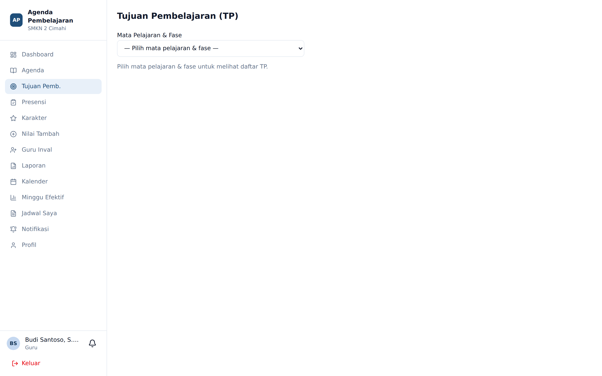

# Tujuan Pembelajaran (TP)

**Siapa yang memakai:** Guru, Wali Kelas
**Menu:** Tujuan Pemb.

## Gagasan Dasar

Tujuan Pembelajaran diketik **sekali** di awal semester, lalu dipakai berulang kali. Ketika
mengisi agenda harian, guru cukup mencentang TP mana yang tercapai — tidak perlu mengetik ulang.
Inilah komponen terbesar yang membuat pengisian agenda selesai di bawah dua menit.

## Cakupan TP

TP tidak melekat pada satu kelas, melainkan pada kombinasi:

**Mata Pelajaran × Fase × Semester × Tahun Ajaran**

| Fase | Berlaku untuk |
|---|---|
| **E** | Kelas X |
| **F** | Kelas XI dan XII |

Konsekuensinya: seluruh guru yang mengajar mata pelajaran yang sama pada fase yang sama akan
**melihat dan berbagi daftar TP yang sama**. Jika guru A menambahkan TP, guru B langsung melihatnya.

⚠️ Karena TP dibagikan, perubahan yang Anda lakukan berdampak pada rekan guru serumpun.
Setiap penambahan, perubahan, dan penghapusan tercatat dalam **log perubahan**. Admin dapat
mengembalikan (revert) perubahan yang keliru.

## Alur Kerja

1. Buka menu **Tujuan Pemb.**
2. Pilih **Mata Pelajaran & Fase** pada dropdown di bagian atas.
3. Pilih **Semester** (Ganjil atau Genap).
4. Daftar TP untuk kombinasi tersebut akan tampil.
5. Tekan **Tambah TP** untuk menambah satu tujuan, atau gunakan **Import Excel** untuk memasukkan
   banyak TP sekaligus.

## Import Massal dari Excel

Untuk memasukkan puluhan TP sekaligus:

1. Tekan **Unduh Template** — berkas Excel berisi kolom yang benar akan terunduh.
2. Isi template. Jangan mengubah, memindahkan, atau menghapus baris judul kolom.
3. Tekan **Import Excel** lalu pilih berkas yang sudah diisi.
4. Sebuah kotak dialog menampilkan hasil: berapa baris **ditambahkan**, berapa **diperbarui**,
   dan daftar baris yang **gagal** beserta alasannya.

💡 Baris yang gagal tidak membatalkan baris yang berhasil. Perbaiki baris yang bermasalah saja,
lalu impor ulang berkasnya — baris yang sudah ada akan diperbarui, bukan diduplikasi.

## Riwayat Perubahan

Tekan **Log Perubahan** untuk melihat siapa mengubah TP apa dan kapan. Ini berguna ketika sebuah
TP tiba-tiba hilang atau berubah redaksinya — Anda dapat menunjukkan kepada Admin catatan mana
yang perlu dikembalikan.
