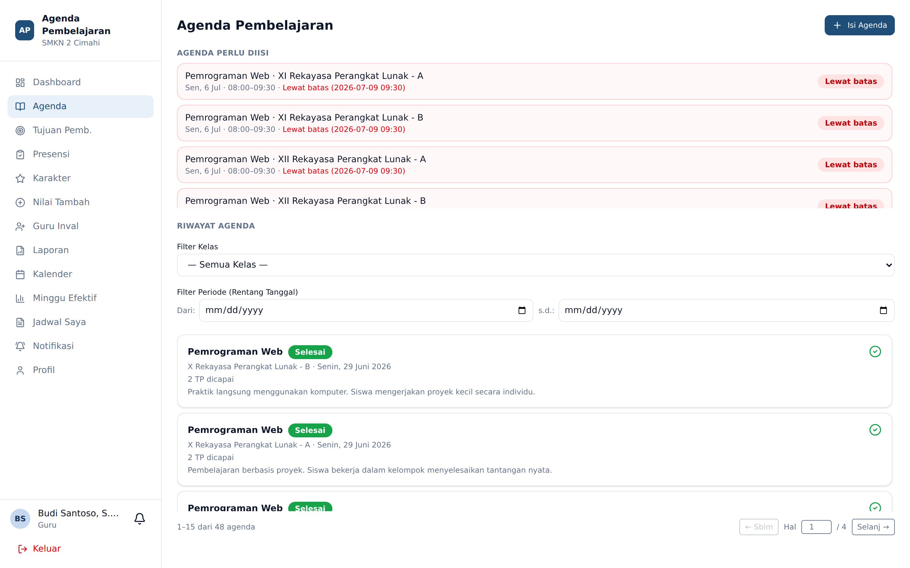
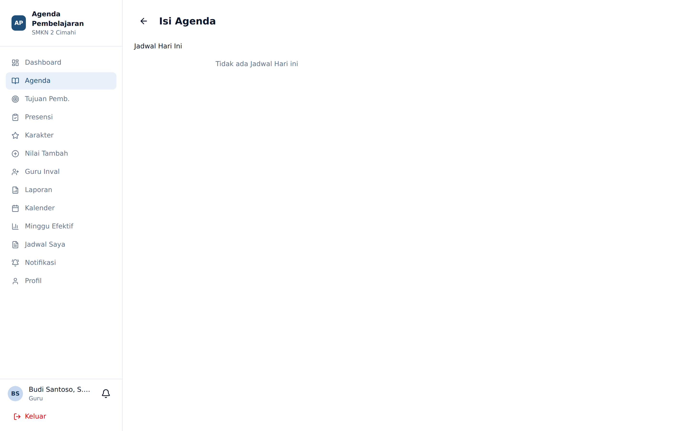
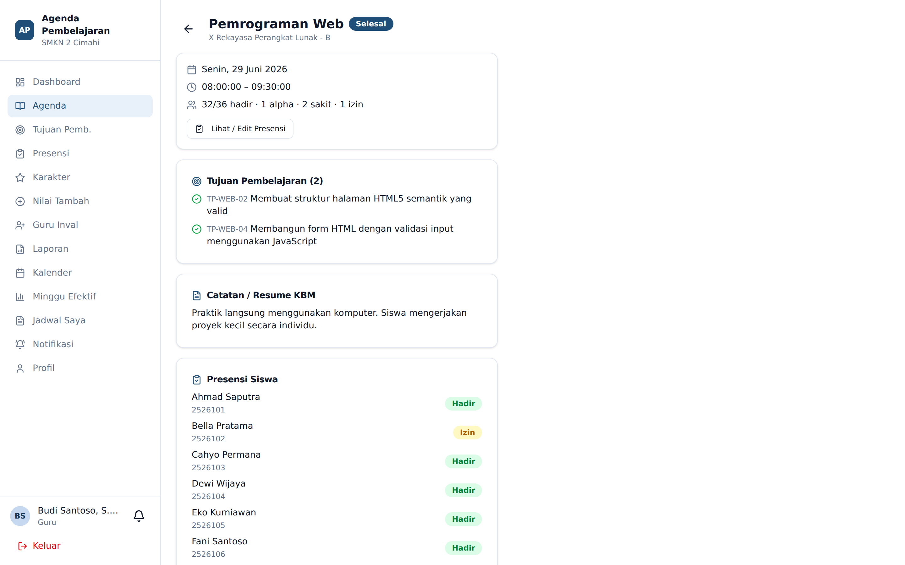

# Agenda Pembelajaran

**Siapa yang memakai:** Guru, Wali Kelas
**Menu:** Agenda

Agenda adalah catatan resmi bahwa sebuah sesi pembelajaran telah berlangsung: kapan, di kelas
mana, tujuan pembelajaran apa yang tercapai, dan bagaimana jalannya KBM.

## Daftar Agenda

Halaman ini menampilkan seluruh sesi mengajar Anda. Setiap baris menunjukkan mata pelajaran,
kelas, tanggal, jam, dan statusnya. Sesi yang belum diisi dan sudah melewati tenggat diberi
label **Lewat batas** berwarna merah beserta tanggal-jam batasnya.

Tersedia penyaring berdasarkan **kelas** dan **rentang tanggal**, serta halaman berpaginasi.

Tekan **Isi Agenda** untuk membuat agenda baru.

## Mengisi Agenda

Formulir dirancang **fokus satu sesi**. Selama Anda belum memilih sesi, halaman menampilkan
dua daftar:

- **Sesi Tertunda** — jadwal lampau yang agendanya belum diisi (lencana oranye menunjukkan jumlahnya).
- **Jadwal Hari Ini** — jadwal pada tanggal berjalan.

Begitu satu sesi dipilih, kedua daftar itu disembunyikan agar tidak mengganggu, dan formulir
pengisian muncul. Tekan **Ganti sesi** bila salah pilih.

Isian formulir, berurutan:

1. **Tanggal** — terisi otomatis. Tanggal tidak boleh melebihi hari ini.
2. **Tujuan Pembelajaran Dicapai** — centang satu atau beberapa TP dari daftar yang sudah Anda
   siapkan. Ini pengganti mengetik ulang materi.
3. **Resume KBM** — ringkasan singkat jalannya pembelajaran.
4. **Presensi Siswa** — daftar seluruh siswa kelas tersebut, semuanya **default Hadir**. Ketuk
   nama siswa untuk memutar statusnya: Hadir → Sakit → Izin → Alpa → kembali Hadir.

Tekan **Simpan Agenda**.

💡 Karena presensi menyatu di dalam formulir agenda, satu sesi selesai dalam sekali simpan.
Anda tidak perlu membuka menu Presensi secara terpisah kecuali ingin memperbaiki data lama.

## Batas Waktu Pengisian

⚠️ Admin menetapkan **batas hari dan jam** setelah jadwal berlangsung, di mana guru masih boleh
membuat agenda baru. Lewat dari itu, tombol simpan ditolak dan sesi tersebut dihitung **Kosong**
pada laporan EWS Guru.

Batas ini hanya berlaku ketika **membuat** agenda baru. **Menyunting** agenda yang sudah pernah
tersimpan tetap diizinkan kapan pun.

Tanggal masa depan tidak pernah diperbolehkan — agenda hanya dapat diisi untuk hari ini atau
hari yang sudah lewat.

## Melihat dan Menyunting Detail

Klik satu baris pada daftar agenda untuk membuka detailnya: TP yang dicentang, resume KBM,
rekap presensi siswa, dan nilai aktivitas kelas. Dari sini Anda dapat menyunting isian.

Setiap penyuntingan tercatat pada **log audit** — sistem menyimpan siapa mengubah, kapan, dan
dari alamat IP mana. Log ini dapat dilihat Admin melalui EWS Guru.
