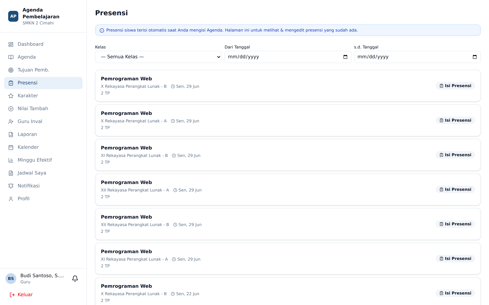
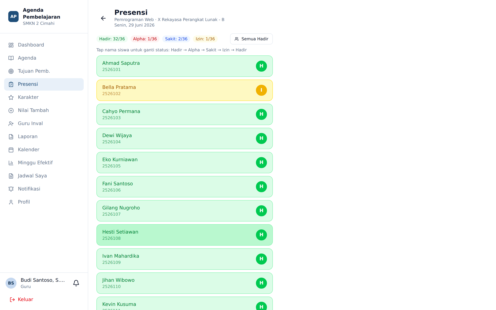

# Presensi per Sesi

**Siapa yang memakai:** Guru, Wali Kelas
**Menu:** Presensi

## Kapan Menu Ini Dipakai

Presensi siswa **sudah menyatu** di dalam formulir Agenda. Menu **Presensi** dipakai untuk:

- Memperbaiki presensi sesi yang sudah tersimpan.
- Melengkapi presensi sesi yang agendanya dibuat lebih dahulu.
- Meninjau rekap kehadiran per sesi.

## Alur Kerja

1. Buka menu **Presensi**.
2. Pilih sesi yang ingin diisi atau diperbaiki.
3. Daftar siswa muncul dengan status **Hadir** sebagai bawaan.

4. Ketuk nama siswa untuk memutar statusnya:

| Status | Kode | Arti |
|---|---|---|
| Hadir | H | Siswa mengikuti sesi |
| Sakit | S | Ada keterangan sakit |
| Izin | I | Ada keterangan izin |
| Alpa | A | Tanpa keterangan |

5. Tekan **Simpan**.

💡 Karena bawaannya Hadir, Anda hanya perlu menyentuh siswa yang **tidak** hadir. Satu kelas
berisi 36 siswa umumnya selesai di bawah 90 detik.

## Dampak ke Sistem Peringatan Dini

Presensi bukan sekadar catatan administratif. Dua hal terjadi otomatis:

1. **Persentase kehadiran** siswa dihitung ulang. Kehadiran di bawah **80%** menyumbang satu
   poin risiko pada perhitungan tingkat EWS siswa.
2. **Alpa berturut-turut** sebanyak **3 kali atau lebih** memicu peringatan yang dikirim kepada
   wali kelas.

Karena itu, ketepatan pengisian Alpa penting: memberi tanda Alpa kepada siswa yang sebenarnya
izin akan memicu peringatan palsu.

## Aturan Tanggal

Presensi tidak dapat diisi untuk tanggal yang belum terjadi. Tanggal masa lalu diperbolehkan.
