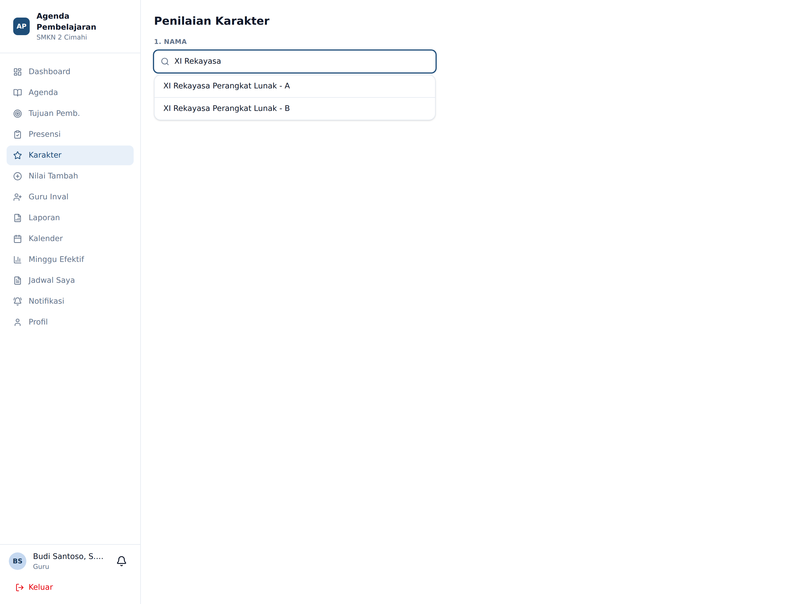
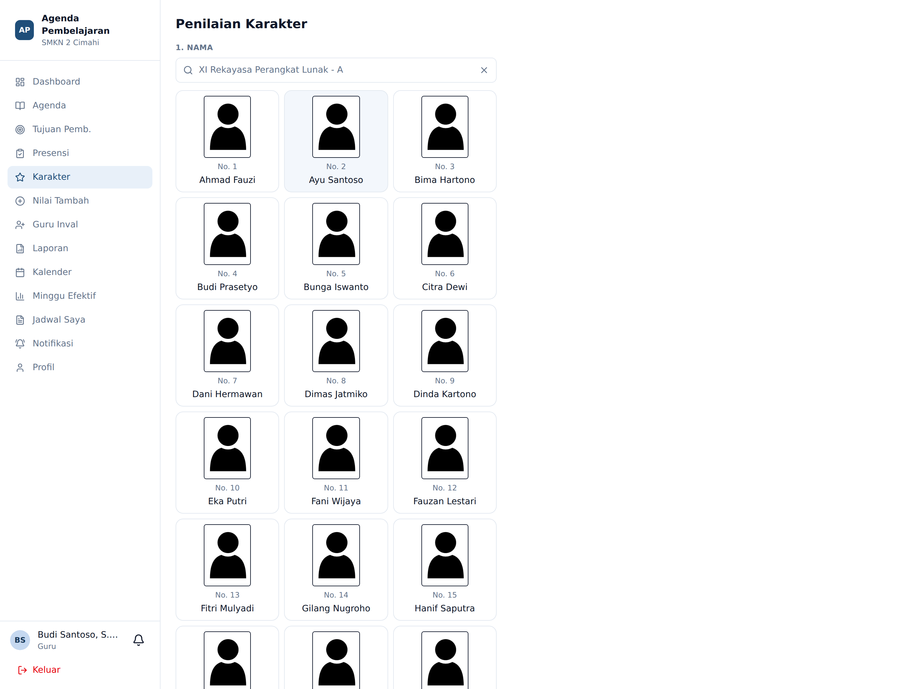
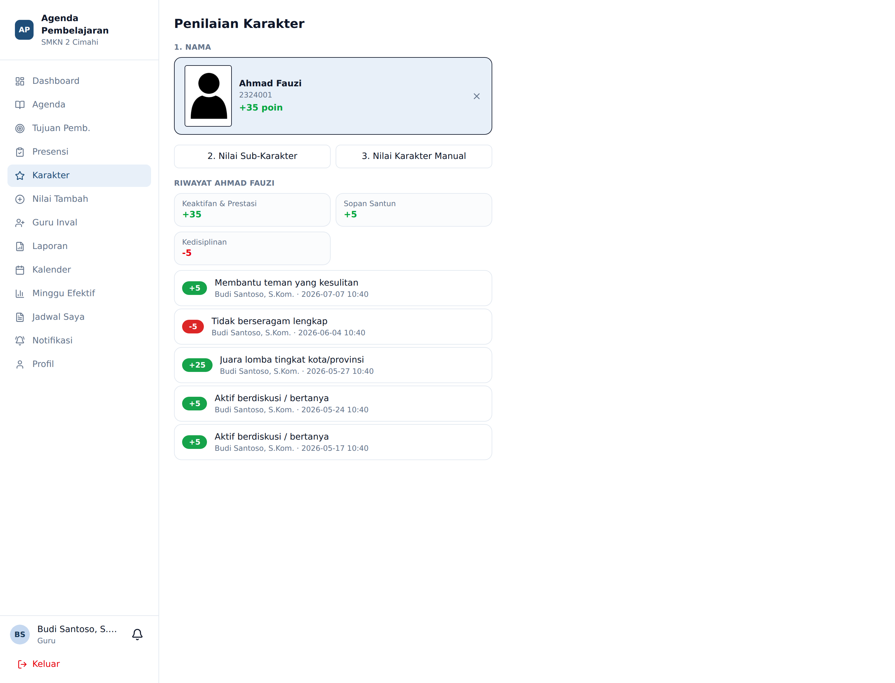

# Penilaian Karakter Berbasis Poin

**Siapa yang memakai:** semua Guru
**Menu:** Karakter

## Gagasan Dasar

Karakter adalah aset kolektif. **Setiap guru yang mengajar** menjadi observer karakter, bukan hanya
wali kelas atau BK. Penilaian dilakukan dengan memilih butir perilaku yang bobot poinnya sudah
ditetapkan sekolah — bukan menuliskan kesan subjektif.

Poin bertanda **positif (+)** adalah apresiasi. Poin bertanda **negatif (−)** adalah catatan
pelanggaran.

## Struktur Penilaian

Butir karakter tersusun dua tingkat: **kategori induk** dan **sub-karakter**. Bobot melekat pada
sub-karakter. Contoh sebagaimana disiapkan sekolah:

| Kategori | Kode | Butir | Bobot |
|---|---|---|---|
| Kedisiplinan | KD-01 | Tepat waktu masuk kelas | +5 |
| Kedisiplinan | KD-03 | Tidak berseragam lengkap | −5 |
| Kedisiplinan | KD-05 | Membawa / menggunakan HP tanpa izin | −10 |
| Sopan Santun | SS-02 | Membantu teman yang kesulitan | +5 |
| Sopan Santun | SS-03 | Berkata tidak sopan / kasar | −10 |
| Keaktifan & Prestasi | KP-01 | Aktif berdiskusi / bertanya | +5 |
| Keaktifan & Prestasi | KP-04 | Juara lomba tingkat kota/provinsi | +25 |

Daftar lengkap dikelola Admin pada **Panel Admin** → tab **Karakter**.

## Alur Kerja: Tiga Langkah

### Langkah 1 — Pilih Kelas

Ketik nama kelas pada kotak pencarian. Kosongkan bila ingin mencari siswa lintas kelas yang
Anda ampu.

### Langkah 2 — Pilih Siswa

Siswa ditampilkan sebagai kartu berfoto dan bernomor absen, sehingga mudah ditemukan tanpa
membaca daftar panjang. Ketuk kartu siswa yang dituju.

### Langkah 3 — Beri Poin

Layar menampilkan identitas siswa, **poin bersih** saat ini, rekap poin per kategori, dan
riwayat penilaian terakhir beserta nama guru pemberinya.

Tersedia dua cara memberi nilai:

- **Nilai Sub-Karakter** — pilih butir baku dari daftar. Ini cara yang dianjurkan.
- **Nilai Karakter Manual** — untuk perilaku yang tidak tercakup daftar baku. Catatan manual
  **wajib ditinjau Admin** sebelum poinnya dihitung.

💡 Satu input poin dirancang selesai di bawah 20 detik. Guru tidak perlu menulis narasi.

## Yang Terjadi Setelah Poin Disimpan

Sistem menjalankan tiga hal secara otomatis:

1. **Poin bersih** siswa dihitung ulang.
2. **Ambang tindakan** diperiksa. Bila poin bersih menembus ambang tertentu, sistem menerbitkan
   **rekomendasi tindakan** yang muncul di halaman EWS siswa. Contoh ambang bawaan:

| Rentang poin | Rekomendasi otomatis |
|---|---|
| ≥ +30 | Apresiasi formal di depan kelas; kandidat siswa berprestasi semester ini |
| +15 s.d. +29 | Pujian dan motivasi; catat sebagai siswa teladan |
| −10 s.d. −19 | Panggil siswa untuk pembinaan langsung oleh wali kelas; catat dalam buku kasus |
| −20 s.d. −49 | Hubungi orang tua; pembinaan intensif oleh wali kelas |
| ≤ −50 | Panggil siswa dan orang tua untuk konseling bersama BK; pertimbangkan surat peringatan formal |

3. **Tingkat EWS** siswa diperbarui. Poin bersih negatif menyumbang satu poin risiko.

## Catatan Manual dan Peninjauan Admin

Catatan manual tidak langsung memengaruhi poin. Catatan masuk ke antrian **Panel Admin** →
tab **Nilai Manual**, di mana Admin dapat **menyetujui**, **menolak**, atau **menyesuaikan**
nilai akhirnya. Baru sesudah disetujui, poin ikut dihitung.

Alasan rancangan ini: menjaga agar skala poin tetap setara antar guru.
