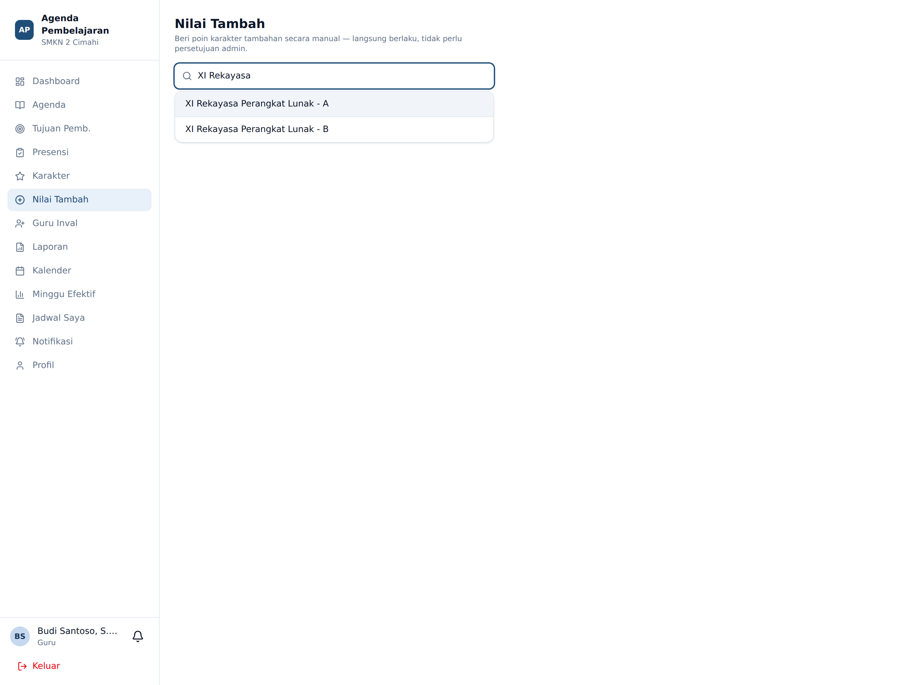
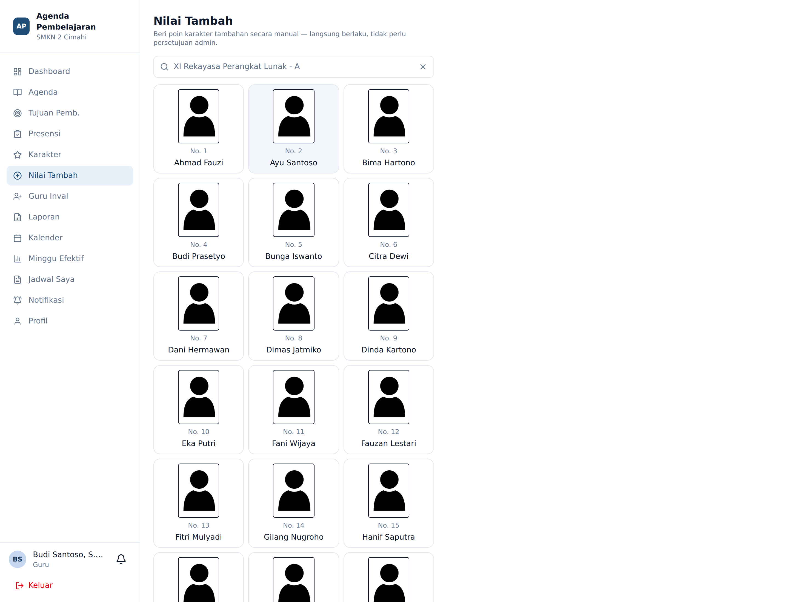
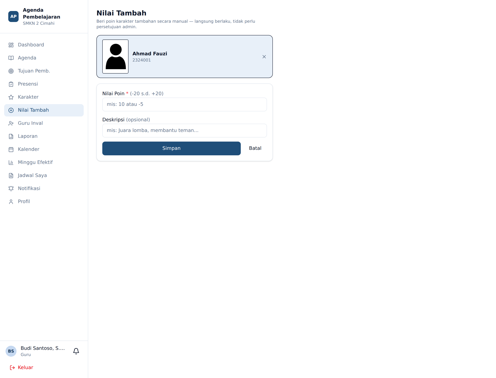

# Nilai Tambah

**Siapa yang memakai:** semua Guru
**Menu:** Nilai Tambah

## Bedanya dengan Penilaian Karakter

Keduanya memberi poin kepada siswa, tetapi jalurnya berbeda:

| | Karakter → Nilai Karakter Manual | Nilai Tambah |
|---|---|---|
| Butir | Diketik bebas | Diketik bebas |
| Rentang poin | Mengikuti bobot yang disetujui Admin | **−20 sampai +20** |
| Perlu persetujuan Admin | **Ya** — poin belum dihitung sebelum disetujui | **Tidak** — poin langsung final |
| Cocok untuk | Perilaku menonjol yang perlu ditimbang setara antar guru | Apresiasi/koreksi ringan sehari-hari di kelas |

Karena poin Nilai Tambah **langsung final**, rentangnya sengaja dibatasi agar tidak mengguncang
skala poin siswa.

## Alur Kerja

### Langkah 1 — Pilih Kelas

### Langkah 2 — Pilih Siswa

Pemilihan siswa memakai pemilih yang sama dengan menu Karakter: ketik nama kelas, lalu ketuk
kartu siswa.

### Langkah 3 — Isi Poin dan Catatan

1. **Nilai Poin** (wajib) — bilangan bulat antara `-20` dan `+20`. Contoh: `10` atau `-5`.
2. **Catatan** — alasan singkat pemberian poin.
3. Tekan **Simpan**.

Poin langsung masuk ke poin bersih siswa dan ikut memicu pemeriksaan ambang rekomendasi serta
pembaruan tingkat EWS, persis seperti poin sub-karakter.

⚠️ Nilai di luar rentang −20…+20 akan ditolak dengan pesan kesalahan. Jika sebuah perilaku
pantas mendapat poin lebih besar, gunakan butir sub-karakter baku pada menu **Karakter**, atau
ajukan lewat **Nilai Karakter Manual** agar ditinjau Admin.
