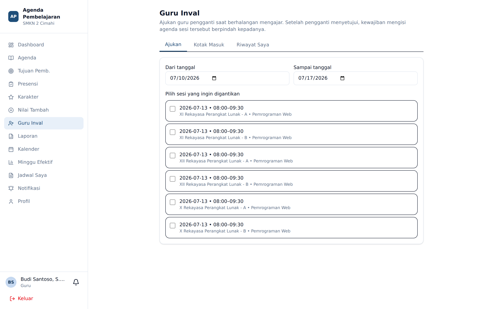

# Guru Inval (Guru Pengganti)

**Siapa yang memakai:** semua Guru
**Menu:** Guru Inval

## Gagasan Dasar

Ketika seorang guru berhalangan mengajar, ia mengajukan **guru pengganti (inval)** untuk sesi
tertentu. Bila pengajuan **disetujui** oleh guru pengganti, kewajiban mengisi agenda dan presensi
sesi tersebut **berpindah** kepada guru pengganti.

⚠️ Hanya status **Disetujui** yang memindahkan kewajiban. Pengajuan yang masih *Diajukan* tidak
memindahkan apa pun — guru asli tetap tercatat wajib mengisi agenda dan tetap dihitung *Kosong*
pada EWS Guru bila tidak diisi.

## Status Pengajuan

| Status | Arti |
|---|---|
| **Diajukan** | Menunggu jawaban guru pengganti |
| **Disetujui** | Guru pengganti menerima; kewajiban agenda & presensi berpindah |
| **Ditolak** | Guru pengganti menolak; kewajiban tetap pada guru pengaju |
| **Dibatalkan** | Guru pengaju menarik pengajuannya |
| **Kedaluwarsa** | Sesi telanjur lewat tanpa jawaban |

## Mengajukan Guru Pengganti

1. Buka menu **Guru Inval**, pilih tab **Pengajuan Keluar**.
2. Tekan **Ajukan Inval**.
3. Centang **sesi** yang ingin dialihkan. Satu pengajuan dapat memuat **1 sampai 12 sesi**
   sekaligus — berguna bila Anda berhalangan seharian atau beberapa hari.
4. Pilih **Guru Pengganti** dari daftar calon. Daftar hanya memuat guru yang tidak sedang
   mengajar pada jam tersebut.
5. Isi **Alasan** (wajib, maksimal 500 karakter). Contoh: *Dinas luar ke Disdik Provinsi*.
6. Isi **Pesan** (opsional, maksimal 2.000 karakter) — instruksi untuk guru pengganti.
7. Isi **Link Tugas** (opsional) — tautan bahan ajar atau tugas, harus berupa URL lengkap
   diawali `https://`.
8. Tekan **Kirim**.

Guru pengganti menerima notifikasi push dan lonceng.

Sesi yang sudah lewat, sudah punya agenda, atau berada pada hari tidak efektif akan ditolak
sistem dengan pesan yang menyebut sesi mana yang bermasalah.

## Menjawab Pengajuan Masuk

Buka tab **Pengajuan Masuk**. Untuk tiap pengajuan tersedia tombol **Setujui** dan **Tolak**.

Sesudah Anda menyetujui:

- Sesi tersebut muncul di blok **Agenda Perlu Diisi** pada dashboard Anda.
- Anda mengisi agenda dan presensi seperti sesi Anda sendiri.
- Guru pengaju tidak lagi dihitung *Kosong* untuk sesi itu pada EWS Guru.

## Membatalkan Pengajuan

Selama status masih **Diajukan**, guru pengaju dapat menekan **Batalkan**. Setelah disetujui,
pembatalan tidak lagi tersedia dari sisi guru; hubungi Admin.

## Pemantauan oleh Admin

Admin melihat seluruh pengajuan sekolah pada **Panel Admin** → tab **Guru Inval**, termasuk
riwayat persetujuan dan penolakan.
