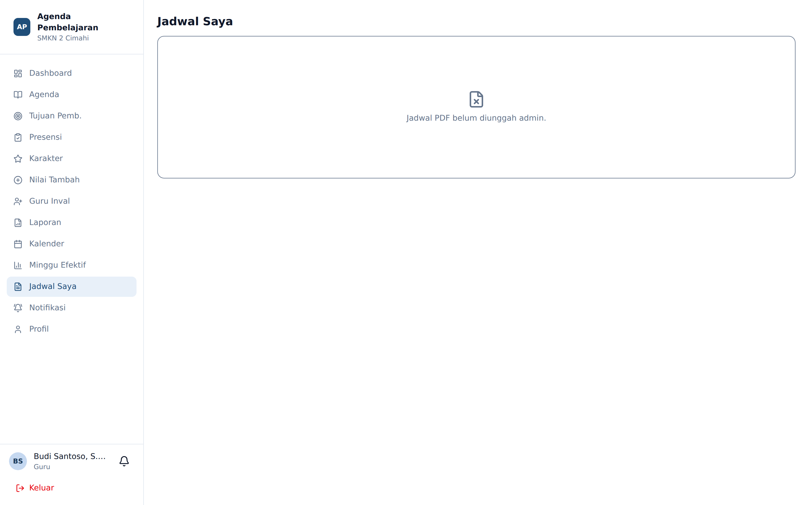
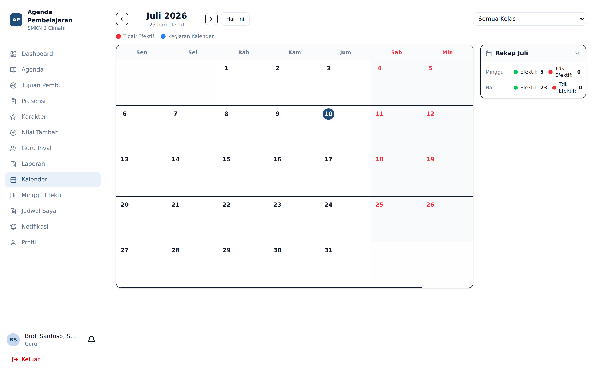
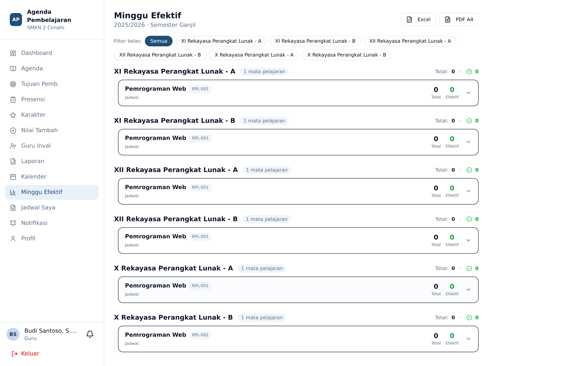

# Jadwal, Kalender, dan Minggu Efektif

**Siapa yang memakai:** Guru, Wali Kelas (Admin memiliki kewenangan menyunting)

## Jadwal Saya

**Menu:** Jadwal Saya

Menampilkan jadwal mengajar Anda sepanjang pekan. Bila Admin telah mengunggah berkas jadwal
resmi, tersedia tombol untuk mengunduhnya sebagai PDF.

Siswa memiliki menu yang sama, berisi jadwal pelajaran kelasnya.

## Kalender

**Menu:** Kalender

Kalender menampilkan satu bulan penuh. Dua jenis informasi ditumpuk di atasnya:

1. **Agenda kegiatan sekolah** yang disinkronkan dari Google Calendar (bila Admin mengaktifkan
   integrasi). Tampil sebagai blok berwarna pada tanggalnya.
2. **Hari Tidak Efektif (HTE)** — hari yang tidak dihitung sebagai hari pembelajaran, misalnya
   libur nasional, ujian, atau kegiatan sekolah.

Panel di sisi kanan meringkas seluruh hari tidak efektif pada bulan tersebut beserta
keterangannya.

⚠️ **Sinkronisasi kalender tidak otomatis menjadikan sebuah tanggal sebagai hari tidak efektif.**
Adanya acara di Google Calendar hanya memudahkan Admin mengisi keterangan. Penandaan hari tidak
efektif tetap tindakan sadar yang dilakukan Admin dengan mengklik tanggal.

Guru hanya dapat melihat. Penandaan dan penyuntingan dilakukan Admin.

## Minggu Efektif

**Menu:** Minggu Efektif

Halaman ini menjawab pertanyaan administratif klasik: *berapa minggu efektif dan berapa jam
pembelajaran yang tersedia semester ini?*

Aturan perhitungan yang dipakai sistem:

- Hari efektif hanya dihitung **di dalam rentang tanggal semester aktif**. Tanggal di luar
  rentang itu diabaikan sepenuhnya.
- **Sabtu dan Minggu** tidak pernah dihitung sebagai hari efektif.
- Sebuah minggu dihitung sebagai **minggu efektif** bila memuat **sekurang-kurangnya tiga hari
  efektif**.
- Hari yang ditandai sebagai Hari Tidak Efektif dikurangkan dari hitungan.

Tersedia penyaring per **kelas** dan per **guru**, serta kolom **Keterangan** untuk catatan umum.

## Mencetak Rekap Minggu Efektif

Tersedia dua keluaran:

| Keluaran | Kapan dipakai |
|---|---|
| **PDF** | Untuk ditandatangani dan diarsipkan. Dibatasi maksimal 40 lembar sekali cetak |
| **Excel** | Untuk rekap massal seluruh kelas atau seluruh guru |

Sebelum mencetak PDF, tekan **Pengaturan Cetak** untuk mengatur ukuran kertas, margin, dan kop
surat. Pratinjau langsung ditampilkan sebelum berkas diunduh.

💡 Bila Anda perlu mencetak rekap untuk banyak kelas sekaligus, gunakan Excel. Ekspor PDF dengan
puluhan lembar sengaja dibatasi agar tidak membebani peladen.
