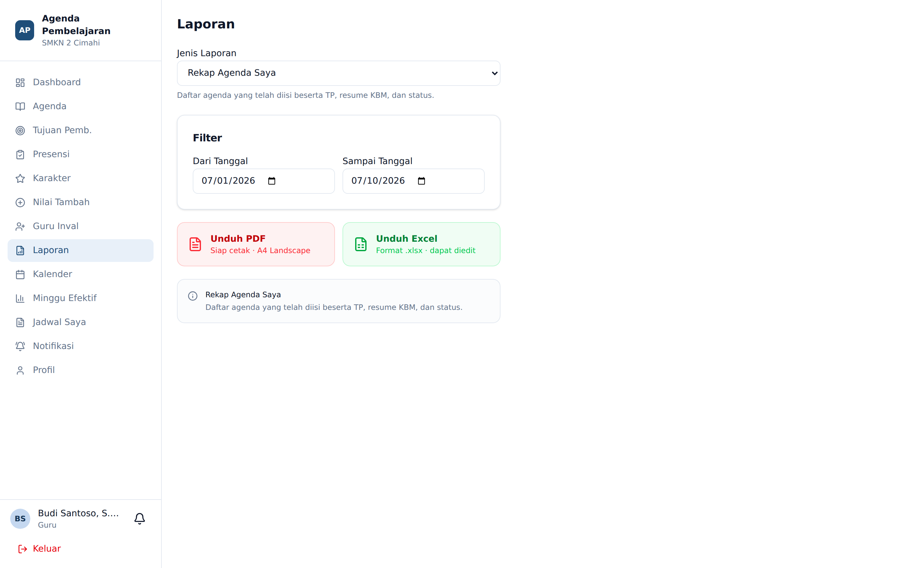

# Laporan

**Siapa yang memakai:** Guru, Wali Kelas, BK, Wakasek, Admin
**Menu:** Laporan

## Jenis Laporan

Pilih jenis laporan dari dropdown **Jenis Laporan** di bagian atas.

| Laporan | Isi | Perlu kelas | Perlu rentang tanggal | Siapa yang boleh |
|---|---|---|---|---|
| **Rekap Agenda Saya** | Agenda yang telah diisi, beserta TP, resume KBM, dan status | — | Ya | Guru, Wali Kelas, Wakasek, Admin |
| **Rekap Kehadiran Siswa** | Hadir, Sakit, Izin, Alpa per siswa; termasuk tanggal ketidakhadiran | Ya | Ya | Guru, Wali Kelas, BK, Wakasek, Admin |
| **Rekap Karakter Siswa** | Akumulasi poin per siswa dan per kategori | Ya | — | Guru, Wali Kelas, BK, Wakasek, Admin |
| **Laporan Nilai Tambah** | Poin Nilai Tambah yang telah diberikan | Ya | — | Guru, Wali Kelas, BK, Wakasek, Admin |
| **Laporan EWS** | Status EWS per siswa pada empat dimensi | Ya | — | Wali Kelas, BK, Wakasek, Admin |

## Alur Kerja

1. Pilih **Jenis Laporan**.
2. Bila jenis laporan memerlukannya, pilih **Kelas**. Guru hanya melihat kelas yang benar-benar
   ia ajar menurut jadwal aktif — bukan kelas yang kebetulan pernah ia isi agendanya.
3. Bila jenis laporan memerlukannya, tentukan rentang **Dari** dan **Sampai**. Tanggal tidak
   boleh melebihi hari ini.
4. Tekan **Pratinjau** untuk melihat hasil, atau langsung **Unduh PDF** / **Unduh Excel**.

Khusus Admin dan Wakasek pada laporan *Rekap Agenda*, tersedia kotak pencarian **Guru** untuk
mencetak rekap agenda milik guru mana pun.

## Pengaturan Cetak

Setiap laporan PDF melewati layar **pratinjau** sebelum diunduh. Tekan **Pengaturan Cetak**
untuk mengatur:

- Ukuran kertas dan orientasi
- Margin
- Kop surat sekolah
- Blok tanda tangan

Pengaturan cetak bersifat **per akun**. Setelan Anda tidak memengaruhi guru lain.

💡 Nama dan gelar pada blok tanda tangan diambil dari halaman **Profil**. Isi gelar depan dan
belakang di sana bila tanda tangan tercetak tanpa gelar.

## PDF versus Excel

Gunakan **PDF** untuk dokumen yang akan ditandatangani dan diarsipkan. Gunakan **Excel** bila
data akan diolah lebih lanjut atau jumlah barisnya sangat banyak.
