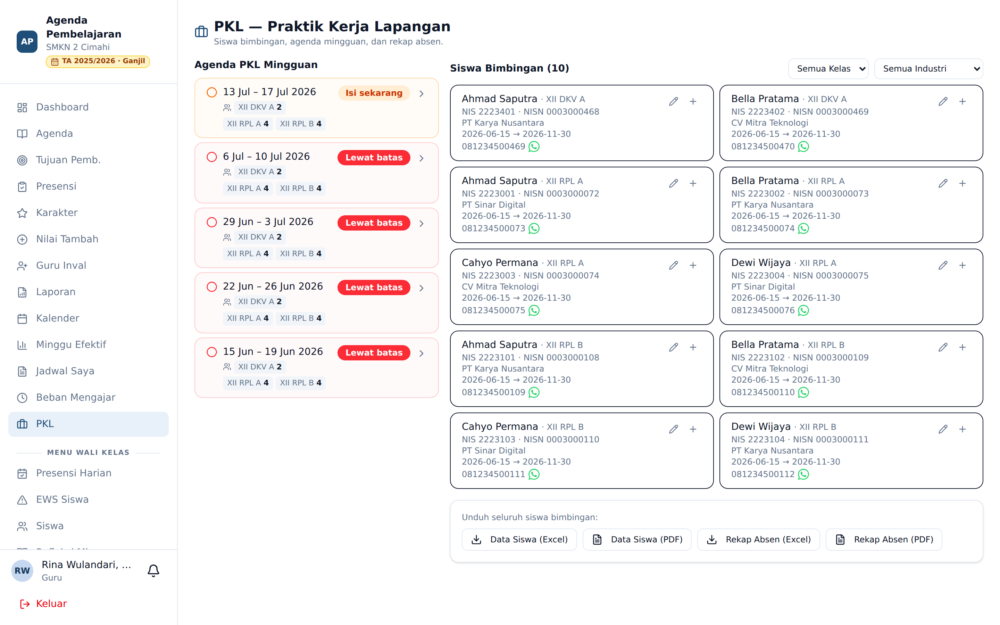
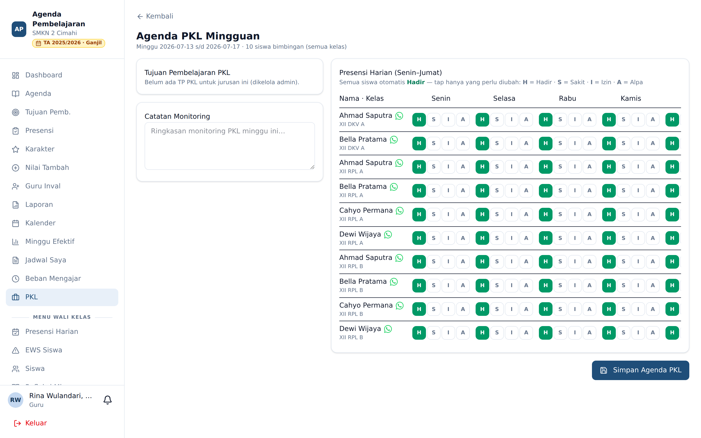

# PKL — Praktik Kerja Lapangan

**Siapa yang memakai:** Guru pembimbing PKL
**Menu:** PKL *(muncul saat Mode PKL aktif dan Anda menjadi pembimbing)*

Ketika Admin mengaktifkan **Mode PKL**, kelas XII yang sedang praktik kerja lapangan berhenti
memakai agenda harian biasa dan beralih ke **agenda PKL mingguan**. Menu **PKL** hanya muncul
untuk guru yang benar-benar ditetapkan sebagai **pembimbing** (memiliki penempatan siswa) — bukan
sekadar guru yang punya jadwal di kelas XII.

## Halaman PKL

Halaman ini menyatukan tiga hal:

1. **Agenda PKL Mingguan** — daftar minggu yang perlu Anda isi.
2. **Siswa Bimbingan** — seluruh anak bimbingan Anda dari semua kelas, langsung tampil tanpa perlu
   memilih kelas dulu, dengan penyaring **kelas** dan **industri**.
3. **Unduhan** — Data Siswa dan Rekap Absen dalam Excel/PDF.

## Mengisi Agenda PKL Mingguan

Karena pembimbingan dilakukan sekaligus untuk semua kelas bimbingan, agenda **cukup diisi satu
kali per minggu** dan otomatis berlaku untuk seluruh kelas Anda. Karena itu daftar minggu
menampilkan **satu tombol per minggu**, bukan satu per kelas. Setiap tombol memuat nama-nama
kelas beserta jumlah siswanya.

⚠️ Agenda PKL sebuah minggu **baru bisa diisi mulai hari Jumat** minggu itu (laporan dibuat di
akhir minggu), sampai batas waktu yang ditetapkan Admin. Minggu yang belum sampai hari Jumat tidak
ditampilkan.

Tekan tombol minggu yang bertanda **Isi sekarang** untuk membuka formulir.

Formulir berisi:

1. **Tujuan Pembelajaran PKL** — centang TP yang relevan (dikelola Admin, bisa lintas jurusan).
2. **Catatan Monitoring** — ringkasan pemantauan minggu ini.
3. **Presensi Harian (Senin–Jumat)** — **seluruh anak bimbingan lintas kelas** tampil bersama
   nama dan kelasnya. Semua siswa **otomatis Hadir**; Anda cukup **mengetuk** tombol **S** (Sakit),
   **I** (Izin), atau **A** (Alpa) untuk yang perlu diubah — tak perlu memilih dari menu.

Tekan **Simpan Agenda PKL**. Satu kali simpan langsung terdistribusi ke seluruh kelas bimbingan,
dan tagihan minggu itu hilang dari daftar serta dari dashboard.

## Prioritas Daftar Minggu

Daftar minggu diurutkan agar yang penting di atas:

- **Paling atas** — minggu berjalan yang harus segera diisi (**Isi sekarang**).
- **Di bawahnya** — minggu yang sudah **Lewat batas** dan belum terisi.
- **Riwayat terisi** disembunyikan di balik tombol lipat, dan minggu yang belum sampai Jumat tidak
  ditampilkan sama sekali.

## Saat Mode PKL Dimatikan

Bila Admin mematikan Mode PKL, menu PKL menghilang. Sesi mengajar kelas XII **hari ini dan ke
depan kembali ditagih sebagai agenda reguler**, sedangkan sesi PKL yang sudah lampau tidak ditagih
ulang. Tagihan agenda PKL yang belum sempat diisi hanya tersisa untuk minggu-minggu lampau
sebagai catatan.

## Data Siswa Bimbingan

Daftar siswa bimbingan menampilkan nama, NIS/NISN, tempat PKL, periode, dan nomor HP dengan
tombol **WhatsApp**. Pembimbing dapat mengedit penempatan atau menambah tempat PKL lain untuk satu
siswa (satu siswa boleh beberapa tempat asal periodenya tidak bertumpuk). Data awal biasanya
diimpor Admin dari Excel.
