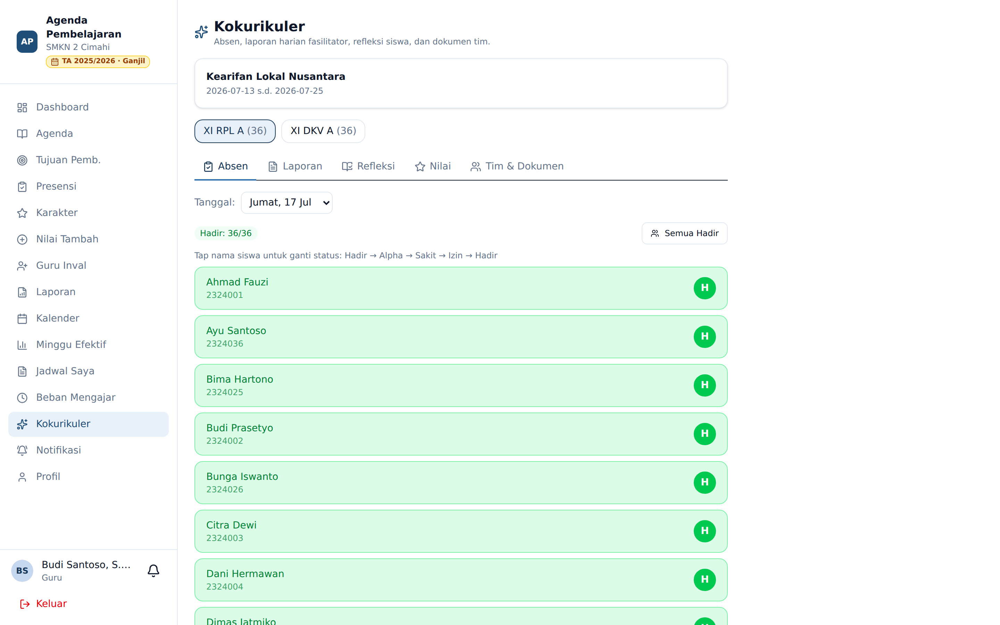

# Kokurikuler

**Siapa yang memakai:** Guru fasilitator kokurikuler (dan siswa peserta)
**Menu:** Kokurikuler *(muncul selama ada projek berjalan yang melibatkan Anda)*

Modul Kokurikuler menampung kegiatan projek (seperti P5) yang dijalankan per tingkat/kelas dalam
rentang tanggal tertentu, dengan penilaian berbasis **dimensi** dan **subdimensi**.

## Pembebasan Agenda Selama Projek

Saat sebuah kelas menjalani projek pada suatu tanggal, **agenda mengajar reguler kelas itu
dibebaskan** — guru mata pelajaran biasa tidak perlu mengisi agenda untuk tanggal tersebut, dan
itu **tidak menjadi hutang**. Sebagai gantinya, **fasilitator** projeklah yang ditagih laporan
harian.

💡 Fasilitator sebuah kelas peserta secara bawaan adalah **wali kelas**-nya, tetapi Admin dapat
menggantinya atau mengimpor daftar fasilitator.

## Tugas Fasilitator

Selama projek berjalan, fasilitator mengisi, per hari pelaksanaan:

1. **Absen peserta** — kehadiran siswa kelas peserta.
2. **Laporan fasilitasi** — catatan pelaksanaan hari itu (muncul sebagai tagihan di *Perlu Diisi*).
3. **Refleksi** dan **nilai per dimensi/subdimensi** siswa.

Tanda tangan fasilitator ikut tercetak pada dokumen ekspor.

## Bagi Siswa Peserta

Siswa yang kelasnya menjadi peserta projek mendapat menu **Kokurikuler** untuk melihat informasi
projek dan mengisi refleksi bila diminta.

## Catatan Status Projek

- Selama projek berstatus **aktif**, kelas dibebaskan **dan** fasilitator ditagih laporan harian.
- Bila projek sudah ditandai **selesai**, kelas tetap dibebaskan untuk tanggal-tanggal projek,
  tetapi fasilitator **tidak lagi** ditagih (kegiatan dianggap rampung).
