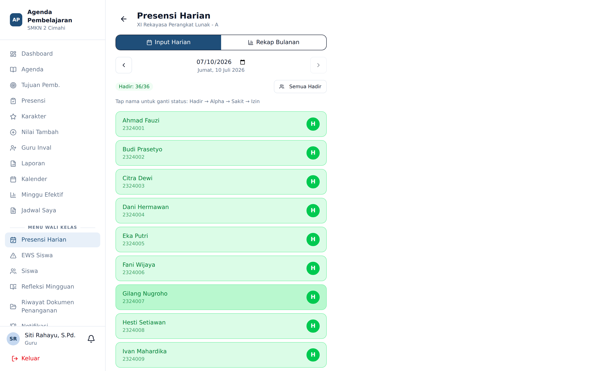

# Presensi Harian

**Siapa yang memakai:** Wali Kelas
**Menu:** Presensi Harian (di bawah bagian *Menu Wali Kelas*)

## Bedanya dengan Presensi Sesi

| | Presensi Sesi | Presensi Harian |
|---|---|---|
| Diisi oleh | Guru mata pelajaran yang mengajar | Wali kelas |
| Cakupan | Satu jam pelajaran | Satu hari penuh |
| Tujuan | Kehadiran per mata pelajaran | Kehadiran administratif kelas |

Keduanya berdiri sendiri. Presensi harian tidak menimpa presensi sesi, dan sebaliknya.

## Mengisi Presensi Harian

1. Buka menu **Presensi Harian**.
2. Pilih **Tanggal**. Bawaannya hari ini; tanggal masa depan tidak diizinkan.
3. Daftar siswa kelas perwalian Anda muncul dengan status bawaan **Hadir**.
4. Ketuk nama siswa untuk mengubah statusnya menjadi Sakit, Izin, atau Alpa.
5. Tekan **Simpan**.

## Rekap Bulanan

Pada bagian bawah halaman tersedia **Rekap Bulanan**. Pilih bulan, dan sistem menampilkan
tabel silang: baris berisi nama siswa, kolom berisi tanggal, dan sel berisi kode kehadiran
(H / S / I / A), diikuti kolom jumlah untuk tiap kategori.

Rekap ini dapat diunduh sebagai PDF atau Excel melalui menu **Laporan** → *Rekap Kehadiran Siswa*.

💡 Gunakan rekap bulanan sebagai bahan rapat wali kelas atau lampiran laporan ke orang tua.
