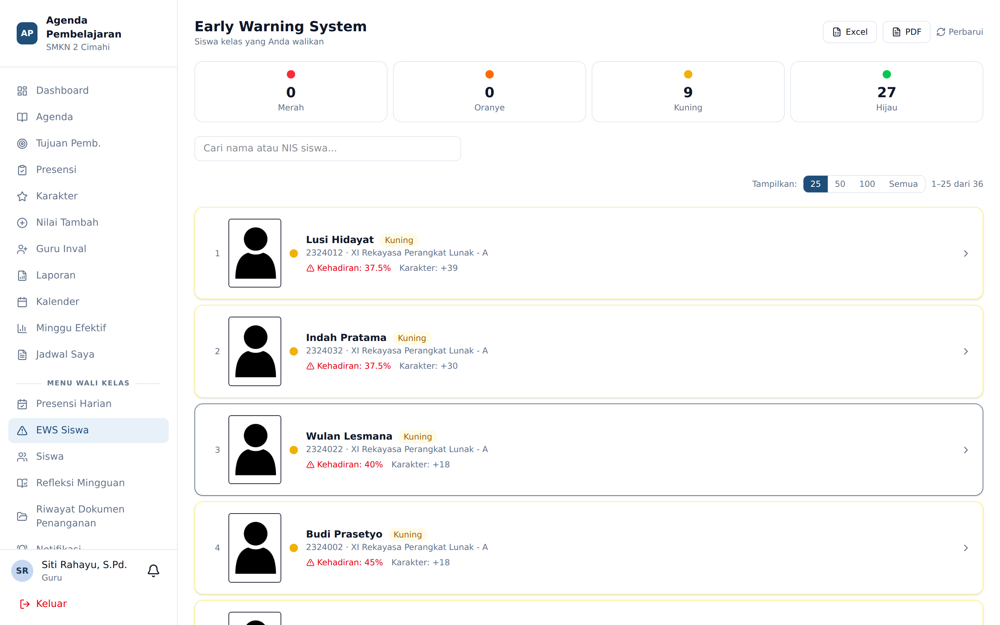
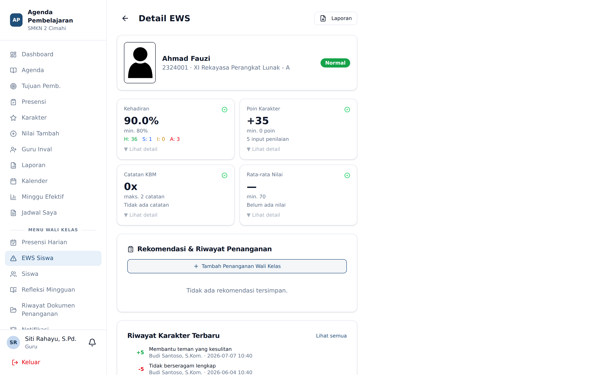

# EWS Siswa (Sistem Peringatan Dini)

**Siapa yang memakai:** Wali Kelas (kelas perwalian), Guru BK (kelas yang diampu), Wakasek, Admin
**Menu:** EWS Siswa

## Gagasan Dasar

EWS mengkorelasikan empat dimensi data yang sudah terkumpul dari kegiatan sehari-hari, lalu
memberi tingkat peringatan per siswa. Tidak ada input tambahan yang diminta dari guru — EWS
adalah hasil sampingan dari agenda, presensi, dan poin karakter.

## Empat Dimensi dan Ambangnya

| Dimensi | Batas aman | Dihitung berisiko bila |
|---|---|---|
| **Kehadiran** | ≥ 80% | Persentase kehadiran di bawah 80% |
| **Poin Karakter** | ≥ 0 | Poin bersih bernilai negatif |
| **Catatan KBM** | ≤ 2 catatan | Terdapat 3 catatan atau lebih |
| **Rata-rata Nilai** | ≥ 70 | Rata-rata nilai di bawah 70 |

## Cara Tingkat Peringatan Ditentukan

Sistem menghitung berapa banyak dimensi yang berisiko, lalu memetakannya:

| Jumlah dimensi berisiko | Tingkat EWS |
|---|---|
| 0 | 🟢 **Hijau** — Normal |
| 1 | 🟡 **Kuning** |
| 2 | 🟠 **Oranye** |
| 3 atau lebih | 🔴 **Merah** |

Setiap kali tingkat siswa **naik** ke Kuning, Oranye, atau Merah, wali kelas menerima notifikasi
eskalasi.

Selain itu, **alpa tiga kali berturut-turut** memicu peringatan tersendiri kepada wali kelas,
terlepas dari tingkat EWS.

## Detail Siswa

Klik satu baris untuk membuka detail.

Layar detail memuat:

1. **Identitas dan tingkat EWS** siswa.
2. **Empat kartu dimensi** dengan angka aktual, ambangnya, dan rincian bila diklik **Lihat detail**.
   Kartu Kehadiran memecah angka menjadi H / S / I / A.
3. **Rekomendasi & Riwayat Penanganan** — rekomendasi otomatis yang terbit karena poin karakter
   siswa menembus ambang tertentu, serta catatan penanganan yang sudah dilakukan.
4. **Riwayat Karakter Terbaru** — poin terakhir beserta nama guru pemberinya dan waktunya.

Tombol **Laporan** di kanan atas mencetak profil EWS siswa sebagai PDF.

## Batas Akses

Ruang lingkup EWS berbeda menurut kapabilitas, bukan menurut peran:

- **Wali kelas** hanya melihat siswa pada **kelas perwaliannya**.
- **Guru BK** melihat siswa pada **kelas yang ia ampu** (menu terpisah: *EWS Murid BK*).
- **Wakasek dan Admin** melihat seluruh siswa sekolah.

Guru mata pelajaran biasa tidak memiliki akses ke EWS.
