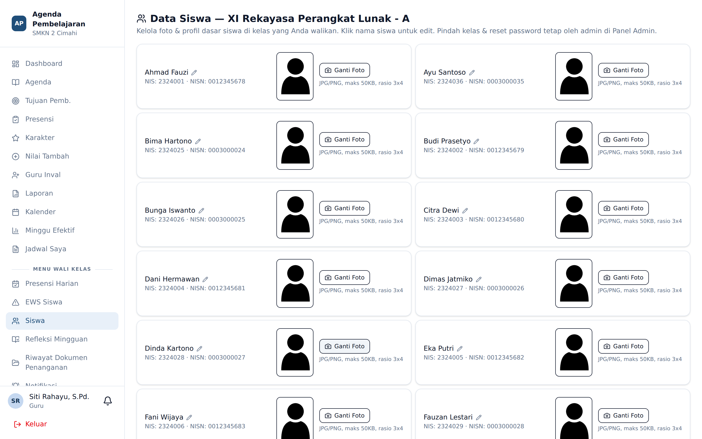
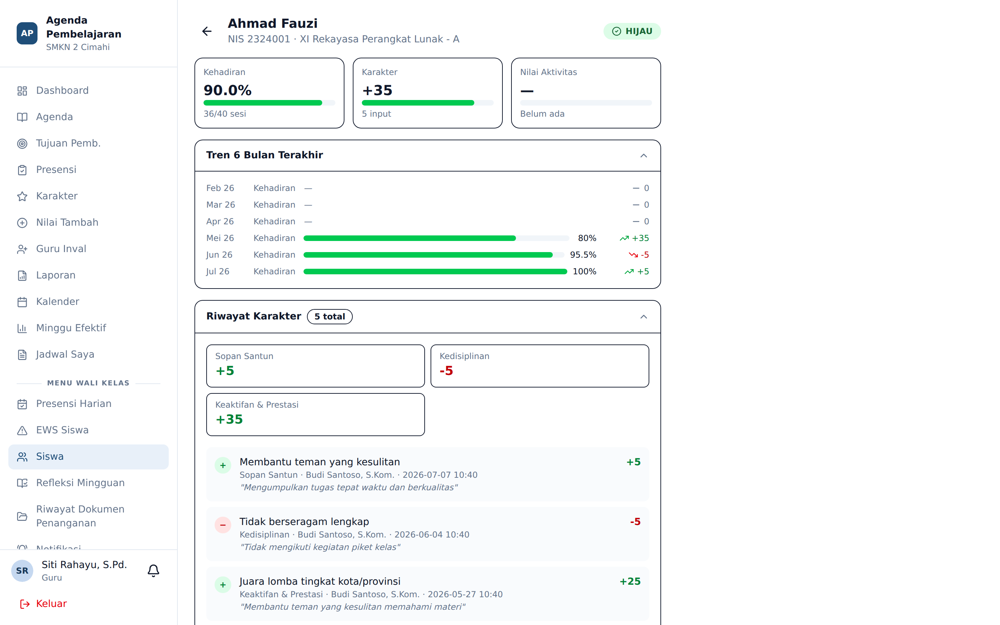

# Data Siswa & Rekam Akademik

**Siapa yang memakai:** Wali Kelas
**Menu:** Siswa

Halaman ini memuat seluruh siswa kelas perwalian Anda. Fungsinya dua: mengelola foto dan profil
siswa, serta membuka rekam akademik masing-masing.

⚠️ Menu ini khusus wali kelas. Guru BK yang bukan wali kelas tidak memilikinya.

## Mengelola Foto Siswa

Ada dua cara mengunggah foto:

- **Satuan** — klik siswa, lalu unggah fotonya.
- **Massal** — Admin mengunggah berkas ZIP berisi banyak foto sekaligus melalui
  **Panel Admin** → tab **Foto Siswa & Guru**.

Foto dikompresi otomatis saat diunggah agar hemat ruang dan cepat dimuat.

Foto siswa dipakai di seluruh aplikasi: kartu pemilihan siswa pada menu Karakter, detail EWS,
dan laporan PDF.

## Melengkapi Profil Siswa

Untuk tiap siswa, wali kelas dapat melengkapi:

- Nama ayah dan nama ibu
- Nomor HP orang tua
- Nama dan kontak wali (bila berbeda dari orang tua)

Data ini dipakai ketika rekomendasi tindakan memerintahkan menghubungi orang tua.

## Rekam Akademik Siswa

Klik nama siswa untuk membuka halaman rekapnya.

Halaman rekap menyatukan seluruh jejak siswa dalam satu layar:

1. Identitas dan foto
2. Rekap kehadiran
3. Akumulasi poin karakter per kategori beserta riwayat penilaian
4. Rekomendasi tindakan yang terbit otomatis
5. Riwayat sesi penanganan oleh wali kelas maupun BK

Halaman ini dapat dicetak sebagai PDF profil siswa untuk keperluan rapat atau pertemuan
dengan orang tua.
