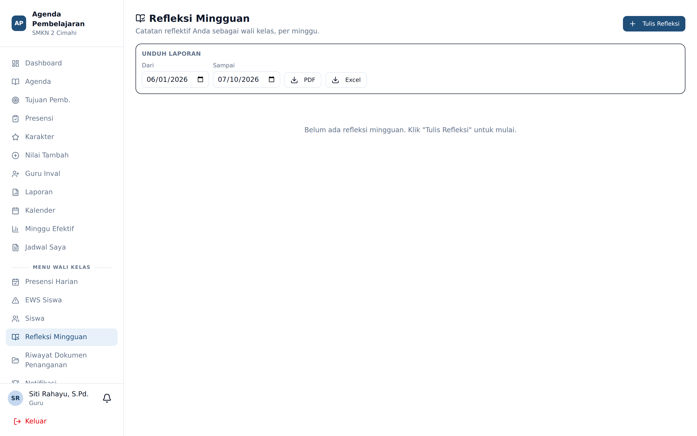
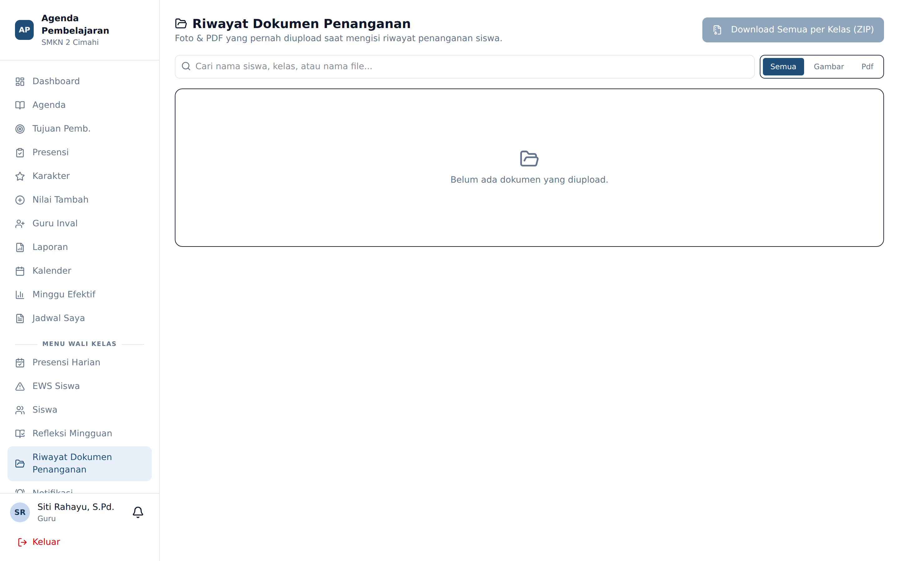

# Penanganan Siswa & Eskalasi ke BK

**Siapa yang memakai:** Wali Kelas, Guru BK
**Masuk lewat:** EWS Siswa → detail siswa → **Tambah Penanganan Wali Kelas**

## Alur Penanganan

Ketika seorang siswa memicu peringatan atau menerima rekomendasi tindakan, wali kelas membuka
sebuah **sesi penanganan**. Sesi ini merekam apa yang dilakukan dan bagaimana hasilnya.

Isian sesi penanganan:

| Kolom | Keterangan |
|---|---|
| **Judul** | Ringkasan kasus dalam satu kalimat |
| **Uraian** | Maksimal sekitar 200 kata. Catatan panjang otomatis diringkas dan dapat dibentangkan |
| **Dokumen** | Lampiran berupa gambar atau PDF, misalnya surat pernyataan atau foto bukti |

Dokumen yang diunggah dikompresi otomatis: gambar melalui pemrosesan ulang, PDF melalui
Ghostscript.

## Papan "Siswa Sedang Ditangani"

Dashboard wali kelas menampilkan daftar siswa yang sesi penanganannya masih terbuka, beserta
**umur kasus** — berapa lama kasus itu dibiarkan tanpa penutupan. Ini mencegah kasus mengendap
diam-diam.

Sesi ditutup dengan menuliskan **resume penutup**. Resume penutup otomatis dibagikan kepada BK.

## Eskalasi ke BK

Bila penanganan wali kelas tidak memadai, kasus dieskalasi kepada Guru BK. BK menerima notifikasi
dan kasus muncul pada dashboard BK.

## Privasi Catatan BK

⚠️ Catatan yang ditulis Guru BK bersifat **privat secara bawaan**. Wali kelas tidak dapat
membacanya kecuali BK secara sadar menyalakan tombol **bagikan** pada catatan tersebut.

Pengecualian: **resume penutup** sebuah sesi selalu dibagikan otomatis, karena wali kelas perlu
mengetahui bahwa kasus telah selesai dan bagaimana kesimpulannya.

Rancangan ini menjaga kerahasiaan materi konseling sekaligus memastikan koordinasi tetap berjalan.

## Refleksi Mingguan

**Menu:** Refleksi Mingguan

Catatan reflektif wali kelas tentang kelas perwaliannya, satu catatan per minggu. Bentuknya
teks bebas: apa yang terjadi minggu ini, tantangan, capaian, dan rencana tindak lanjut.

1. Tekan **Tulis Refleksi**.
2. Pilih minggu. Sistem otomatis mengambil hari Senin dari minggu yang bersangkutan.
   Minggu yang belum terjadi tidak dapat diisi.
3. Tulis catatan, lalu **Simpan**.

Refleksi dapat diunduh sebagai laporan.

## Riwayat Dokumen Penanganan

**Menu:** Riwayat Dokumen Penanganan

Halaman terpisah untuk menelusuri seluruh dokumen yang pernah dilampirkan pada sesi penanganan.
Tersedia penyaring berdasarkan **kelas**. Dokumen dapat diunduh satu per satu, atau seluruhnya
sekaligus sebagai berkas ZIP.

Halaman ini hanya tersedia bagi guru yang berkapabilitas wali kelas dan/atau BK, serta bagi
Admin dan Wakasek. Guru mata pelajaran biasa tidak memilikinya.
