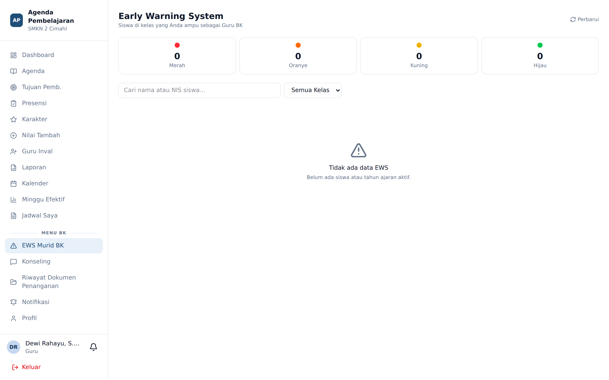

# EWS Murid BK

**Siapa yang memakai:** Guru BK
**Menu:** EWS Murid BK (di bawah bagian *Menu BK*)

## Ruang Lingkup

Guru BK melihat siswa pada **kelas yang ia ampu**, bukan seluruh siswa sekolah.

⚠️ Pembatasan ini penting dan disengaja. Akses BK ditentukan oleh kelas yang benar-benar
ditugaskan kepadanya, bukan oleh statusnya sebagai guru BK. Bila daftar siswa Anda kosong,
hubungi Admin untuk memastikan penugasan kelas Anda sudah terdaftar.

Bila seorang guru sekaligus menjadi wali kelas dan guru BK, ia mendapat **dua menu EWS terpisah**:

- **EWS Siswa** — berisi kelas perwaliannya
- **EWS Murid BK** — berisi kelas yang ia ampu sebagai BK

Keduanya sengaja dipisah agar jelas dalam kapasitas apa Anda sedang bekerja.

## Membaca Tingkat Peringatan

Perhitungan tingkat EWS sama persis dengan yang dipakai wali kelas — lihat
*04-modul-wali-kelas/02-ews-siswa.md* untuk empat dimensi dan ambangnya.

Ringkasnya: kehadiran di bawah 80%, poin karakter negatif, catatan KBM tiga kali atau lebih,
dan rata-rata nilai di bawah 70. Setiap dimensi yang berisiko menambah satu tingkat, dari Hijau
sampai Merah.

## Menindaklanjuti

Klik siswa untuk membuka detail EWS-nya, lalu buka sesi konseling dari sana, atau gunakan
menu **Konseling** untuk mencari siswa secara langsung.
