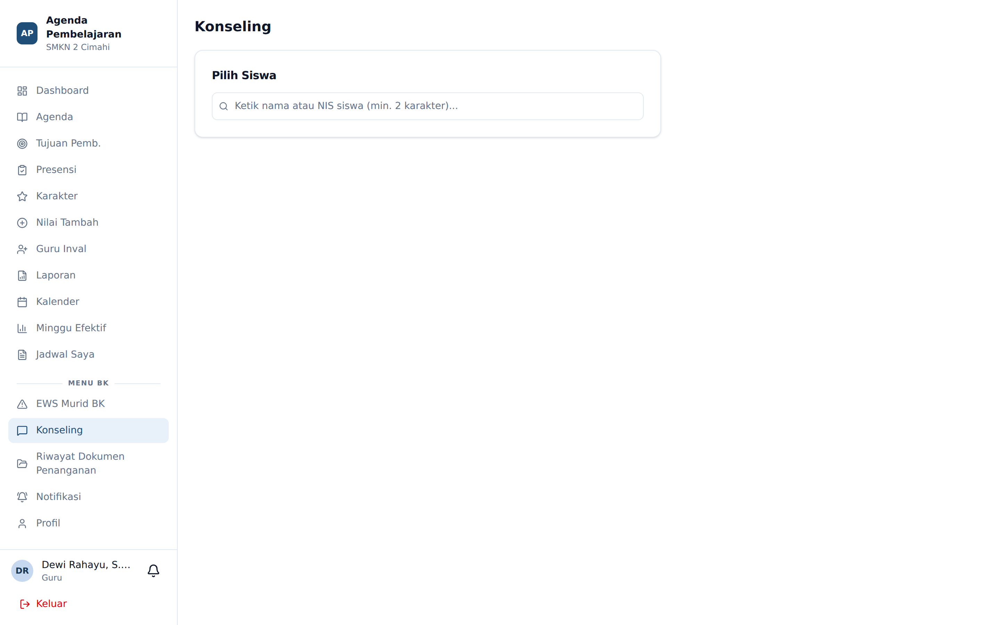
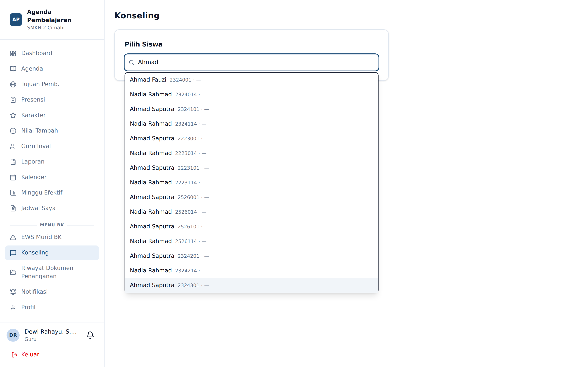
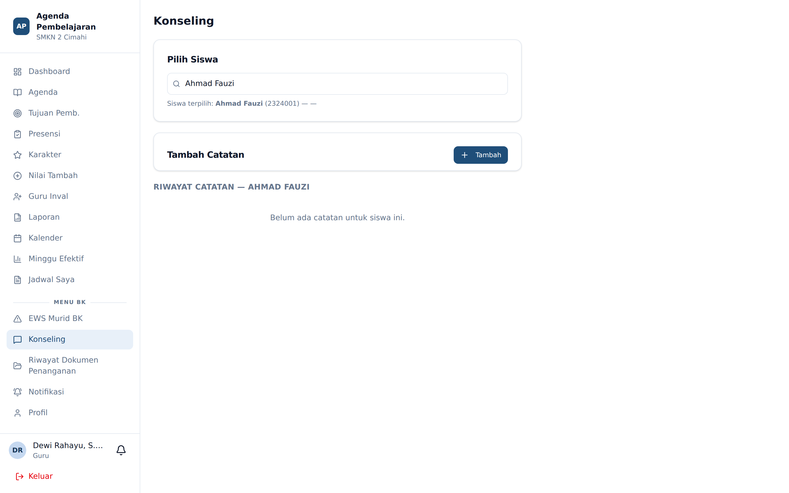

# Konseling

**Siapa yang memakai:** Guru BK
**Menu:** Konseling

## Mencari Siswa

Halaman dibuka dalam keadaan kosong: hanya ada satu kotak pencarian. Ini disengaja — BK bekerja
per kasus, bukan menelusuri daftar.

Ketik **nama atau NIS** siswa, minimal dua karakter.

Pilih siswa dari hasil pencarian.

## Layar Kasus Siswa

Setelah siswa dipilih, layar menampilkan riwayat lengkap: identitas, tingkat EWS, poin karakter,
sesi penanganan yang pernah dilakukan wali kelas, dan catatan konseling sebelumnya.

## Menulis Catatan Konseling

Tekan **Tambah Sesi Konseling** dan isi:

| Kolom | Keterangan |
|---|---|
| **Judul** | Ringkasan kasus dalam satu kalimat |
| **Catatan** | Uraian sesi konseling |
| **Dokumen** | Lampiran gambar atau PDF, bila ada |
| **Bagikan ke wali kelas** | Sakelar. **Mati secara bawaan** |

## Aturan Privasi

⚠️ Catatan konseling bersifat **privat secara bawaan**. Wali kelas tidak dapat membacanya
kecuali Anda menyalakan sakelar **bagikan** pada catatan tersebut.

Satu pengecualian: ketika Anda **menutup** sebuah sesi dengan menuliskan **resume penutup**,
resume itu otomatis dibagikan kepada wali kelas. Alasannya, wali kelas berhak tahu bahwa kasus
telah selesai dan apa kesimpulannya, tanpa perlu membaca isi konseling yang sensitif.

Pertimbangkan baik-baik sebelum membagikan catatan: sekali dibagikan, wali kelas dapat membacanya.

## Menerima Eskalasi

Kasus yang dieskalasi wali kelas muncul pada dashboard BK. Anda menerima notifikasi push bila
notifikasi diaktifkan pada menu **Notifikasi**.
