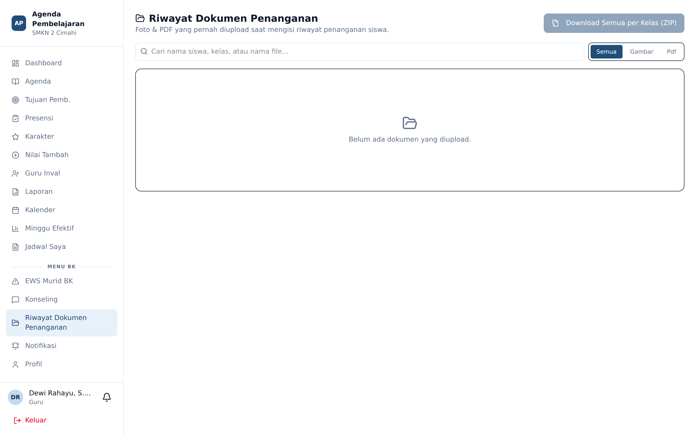

# Riwayat Dokumen Penanganan

**Siapa yang memakai:** Guru BK, Wali Kelas, Admin, Wakasek
**Menu:** Riwayat Dokumen Penanganan

## Fungsi

Semua dokumen yang pernah dilampirkan pada sesi penanganan wali kelas maupun sesi konseling BK
terkumpul di satu halaman ini. Berguna ketika Anda perlu menelusuri berkas lama tanpa harus
membuka kembali kasus siswa satu per satu.

## Alur Kerja

1. Buka menu **Riwayat Dokumen Penanganan**.
2. Gunakan penyaring **kelas** untuk mempersempit daftar.
3. Untuk mengunduh:
   - **Satu berkas** — tekan tombol unduh pada barisnya.
   - **Seluruh berkas terpilih** — tekan **Unduh ZIP**.

## Kompresi Otomatis

Dokumen dikompresi ketika diunggah:

| Jenis berkas | Cara kompresi |
|---|---|
| Gambar (JPG, PNG) | Diproses ulang oleh pustaka grafis peladen |
| PDF | Dikompresi dengan Ghostscript |

Berkas yang Anda unduh adalah versi terkompresi tersebut.

## Tempat Penyimpanan

Bila Admin mengaktifkan penyimpanan awan pada **Panel Admin** → tab **Penyimpanan**, dokumen
disimpan di Cloudflare R2. Bila tidak, dokumen disimpan di cakram peladen. Bagi pengguna,
perilakunya sama persis.
