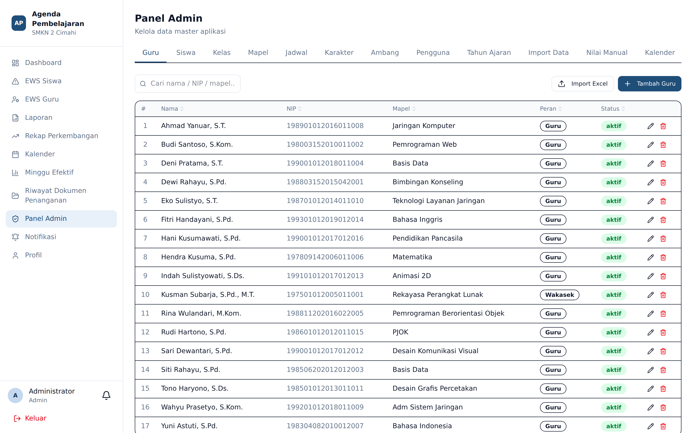
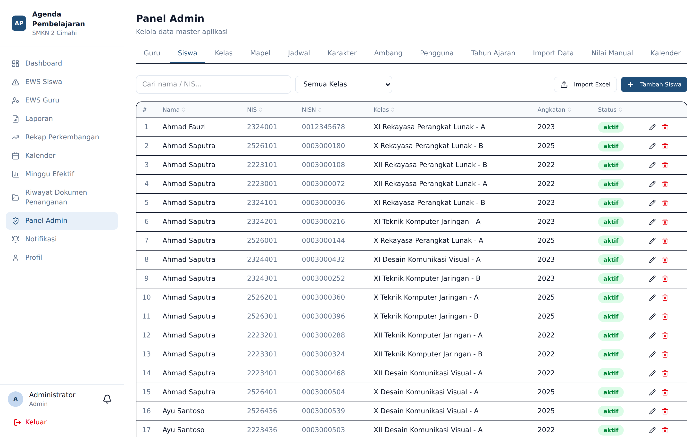
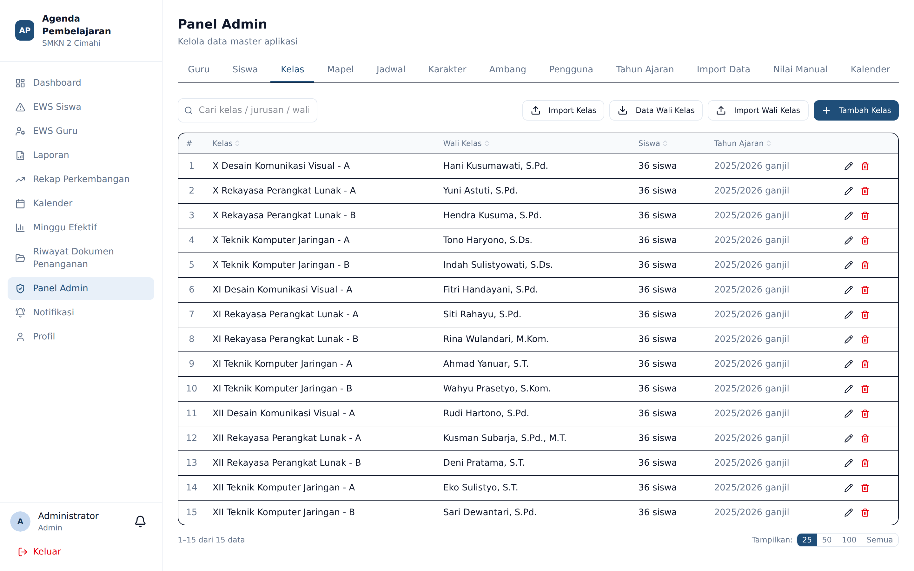
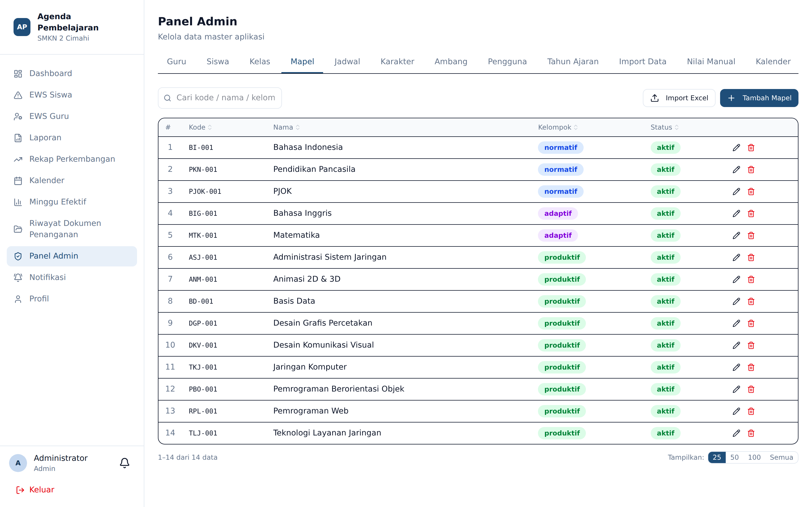
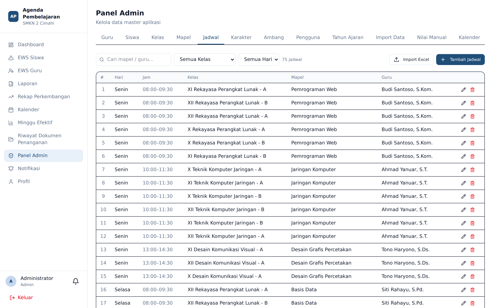
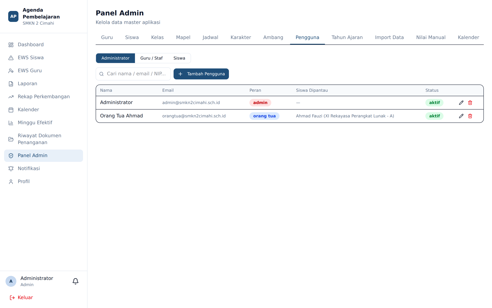

# Panel Admin — Data Master

**Siapa yang memakai:** Admin, Wakasek
**Menu:** Panel Admin


Panel Admin terdiri dari 20 tab. Bab ini membahas lima tab data master yang menjadi fondasi
seluruh aplikasi. Isi tab-tab ini **dengan urutan yang benar**, karena satu bergantung pada
lainnya.

## Urutan Pengisian yang Benar

```
1. Tahun Ajaran   →  wadah bagi semua data lain
2. Mapel          →  mata pelajaran
3. Guru           →  siapa yang mengajar
4. Kelas          →  rombongan belajar + penetapan wali kelas
5. Siswa          →  siapa yang belajar, di kelas mana
6. Jadwal         →  guru × mapel × kelas × hari × jam
```

⚠️ Membuat jadwal sebelum guru, mapel, dan kelas tersedia akan gagal. Membuat siswa sebelum kelas
tersedia juga gagal.

## Tab Guru



Menampilkan seluruh guru beserta NIP, mata pelajaran utama, peran, dan status.

- **Tambah Guru** — membuat akun guru satuan.
- **Import Excel** — memasukkan banyak guru sekaligus (lihat bab *Import Data*).
- Ikon pensil untuk menyunting, ikon tempat sampah untuk menghapus.
- Kotak pencarian menerima nama, NIP, atau mata pelajaran.

Di sini pula Admin menandai seorang guru sebagai **guru BK**. Penandaan itulah yang memunculkan
*Menu BK* di sidebar guru bersangkutan.

## Tab Siswa



Daftar siswa dengan NIS, NISN, kelas, dan angkatan.

⚠️ NIS, NISN, dan NIP adalah **deretan angka panjang**, bukan bilangan. Ketika menyiapkan berkas
Excel, format kolomnya sebagai **teks**. Bila diformat sebagai angka, angka nol di depan akan
hilang dan digit terakhir dapat berubah karena pembulatan.

## Tab Kelas



Kelas dibentuk dari **tingkat** (X, XI, XII), **jurusan**, dan **rombel** (A, B, …).

Di tab inilah **wali kelas ditetapkan**. Menetapkan seorang guru sebagai wali kelas pada kelas di
tahun ajaran yang sedang aktif akan langsung memunculkan *Menu Wali Kelas* pada sidebar guru itu.

Tersedia pula **Import/Export Wali Kelas** untuk penetapan massal.

## Tab Mapel



Daftar mata pelajaran. Mata pelajaran adalah acuan bagi Tujuan Pembelajaran dan jadwal.

## Tab Jadwal



Jadwal menghubungkan guru, mata pelajaran, kelas, hari, dan jam. Jadwal adalah **sumber
kebenaran** bagi banyak hal:

- Blok *Agenda Perlu Diisi* pada dashboard guru
- Daftar kelas yang boleh dipilih guru pada menu Laporan
- Perhitungan *Kosong* dan *Terisi* pada EWS Guru
- Daftar calon guru pengganti pada modul Guru Inval

⚠️ Jadwal yang salah menyebabkan guru dituduh tidak mengisi agenda untuk sesi yang sebenarnya
bukan miliknya. Periksa jadwal terlebih dahulu bila ada keluhan semacam itu.

## Tab Pengguna



Mengelola akun yang bukan guru maupun siswa: Admin, Wakasek, dan Orang Tua. Akun orang tua
ditautkan ke satu siswa.

Dari tab ini Admin dapat menyetel ulang kata sandi pengguna yang lupa.

## Paginasi dan Pencarian

Seluruh tab data master menyediakan pencarian, pengurutan kolom, dan paginasi dengan pilihan
25 / 50 / 100 / Semua baris per halaman.
