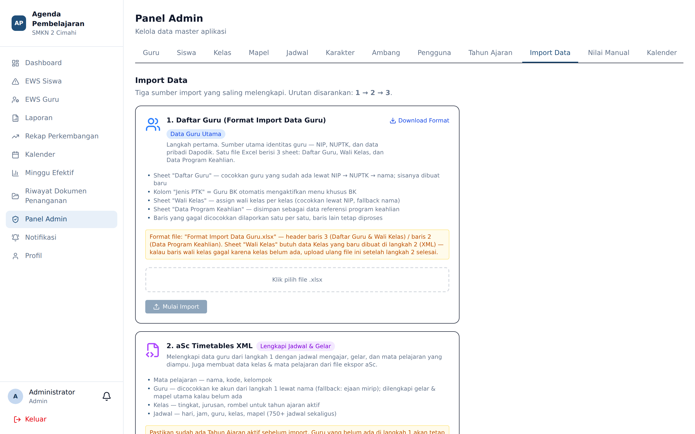

# Import Data

**Siapa yang memakai:** Admin
**Menu:** Panel Admin → tab **Import Data**

## Urutan Impor yang Dianjurkan

Urutan ini penting karena berkas yang belakangan bergantung pada data yang lebih dahulu.

| Urutan | Sumber | Isi | Keterangan |
|---|---|---|---|
| 1 | `Format Import Data Guru.xlsx` | Data guru | **Sumber utama** identitas guru |
| 2 | Berkas XML jadwal | Gelar & jadwal | Pelengkap: melengkapi gelar dan membentuk jadwal |
| 3 | Berkas siswa | Data siswa | Terakhir, setelah kelas terbentuk |

## Alur Umum

1. Tekan **Unduh Template** pada entitas yang ingin diimpor.
2. Isi template. **Jangan menambah, menghapus, atau memindahkan baris judul kolom.**
3. Tekan **Import Excel** dan pilih berkas.
4. Baca kotak hasil: jumlah baris ditambahkan, diperbarui, dan gagal beserta alasannya.
5. Perbaiki hanya baris yang gagal, lalu impor ulang. Baris yang sudah ada akan **diperbarui**,
   bukan diduplikasi.

## Jebakan yang Sering Terjadi

### Digit NIP, NIK, NIS, dan NISN rusak

⚠️ Excel memperlakukan deretan angka panjang sebagai bilangan. Akibatnya angka nol di depan
hilang dan digit terakhir berubah karena pembulatan presisi.

**Solusi:** format kolom sebagai **Teks** sebelum menempelkan data, atau awali nilainya dengan
tanda kutip tunggal (`'198003152010011002`).

### Akun guru terduplikasi

⚠️ Sistem pernah membuat akun guru ganda ketika nama seorang guru ditulis sedikit berbeda antara
berkas Excel dan berkas XML — misalnya berbeda gelar, berbeda spasi, atau berbeda ejaan.

**Solusi:** pastikan penulisan nama **identik** di seluruh berkas sumber sebelum mengimpor.
Bila akun ganda telanjur terbentuk, gabungkan lewat tab **Guru**; jangan sekadar menghapus salah
satunya, karena agenda dan poin karakter bisa telanjur menempel pada akun yang salah.

### Kolom program keahlian tidak dikenali

Kode program keahlian harus sesuai daftar yang dipakai sekolah. Kode yang tidak dikenali membuat
kelas gagal terbentuk.

### Penulisan kolom kelas

Pada berkas yang memuat kolom **kelas** (siswa, jadwal, wali kelas, PKL), Anda boleh menuliskan
**kode** (mis. `XII RPL A`) maupun **nama jurusan lengkap** (`XII Rekayasa Perangkat Lunak A`) —
keduanya dikenali. Bila kelas tidak ditemukan, aplikasi menyarankan penulisan yang mirip agar Anda
tahu harus menulis apa; ejaan tetap harus **persis** seperti pada menu Kelas.

> Impor **Jam & Bel** memakai alurnya sendiri di menu *Jam & Bel* (grup Akademik), bukan di tab
> Import Data ini. Lihat *Jam & Bel*.

## Setelah Impor

Periksa hasilnya:

1. Buka tab **Guru** dan **Siswa**, pastikan jumlah barisnya sesuai harapan.
2. Buka tab **Jadwal**, pastikan tidak ada guru yang terjadwal bentrok.
3. Masuk sebagai salah satu guru dan periksa apakah blok *Jadwal Minggu Ini* pada dashboardnya
   sudah benar.
