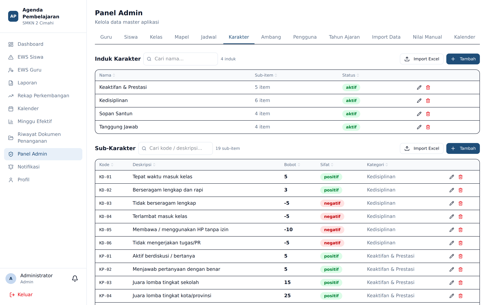
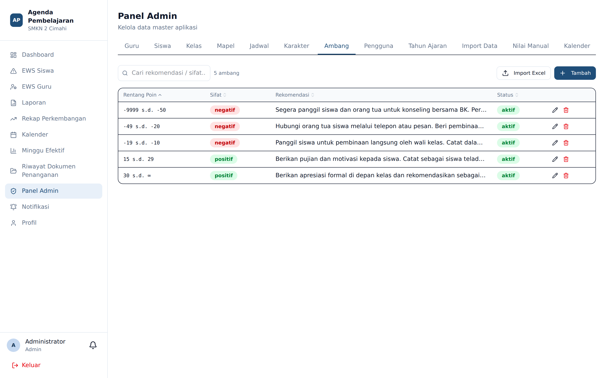
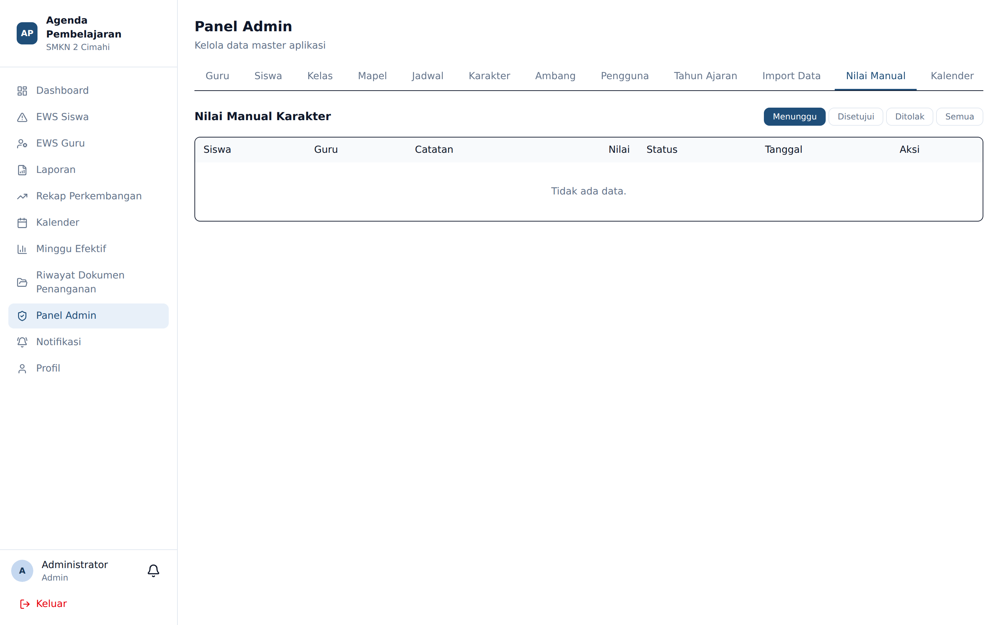

# Karakter, Ambang, dan Nilai Manual

**Siapa yang memakai:** Admin
**Menu:** Panel Admin → tab **Karakter**, **Ambang**, **Nilai Manual**

## Tab Karakter

Mengelola daftar butir penilaian karakter dalam dua tingkat:

1. **Kategori induk** — misalnya Kedisiplinan, Sopan Santun, Keaktifan & Prestasi, Tanggung Jawab.
2. **Sub-karakter** — butir perilaku konkret, masing-masing punya **kode**, **deskripsi**,
   **bobot**, dan **sifat** (positif atau negatif).

Contoh butir bawaan:

| Kode | Deskripsi | Bobot | Sifat |
|---|---|---|---|
| KD-01 | Tepat waktu masuk kelas | +5 | Positif |
| KD-05 | Membawa / menggunakan HP tanpa izin | −10 | Negatif |
| SS-03 | Berkata tidak sopan / kasar | −10 | Negatif |
| KP-04 | Juara lomba tingkat kota/provinsi | +25 | Positif |

⚠️ Mengubah bobot butir tidak menghitung ulang poin yang sudah telanjur diberikan. Ubah bobot di
awal semester, bukan di tengah jalan.

## Tab Ambang

Ambang menentukan **kapan sistem menerbitkan rekomendasi tindakan** secara otomatis. Setiap
ambang berisi rentang poin (`min_point` sampai `max_point`), sifat, dan teks rekomendasi.

Ambang bawaan:

| Rentang poin bersih | Sifat | Rekomendasi otomatis |
|---|---|---|
| ≥ +30 | Positif | Apresiasi formal di depan kelas; kandidat siswa berprestasi semester ini |
| +15 s.d. +29 | Positif | Pujian dan motivasi; catat sebagai siswa teladan |
| −10 s.d. −19 | Negatif | Panggil siswa untuk pembinaan langsung oleh wali kelas; catat dalam buku kasus |
| −20 s.d. −49 | Negatif | Hubungi orang tua; pembinaan intensif oleh wali kelas |
| ≤ −50 | Negatif | Panggil siswa dan orang tua untuk konseling bersama BK; pertimbangkan surat peringatan formal |

Rekomendasi yang terbit muncul pada halaman EWS siswa, dilihat wali kelas dan BK.

Ambang dapat dinonaktifkan tanpa dihapus, melalui sakelar **aktif**.

## Tab Nilai Manual

Antrian peninjauan untuk **Nilai Karakter Manual** yang diajukan guru — yaitu perilaku yang tidak
tercakup butir baku.

Untuk tiap ajuan, Admin dapat:

- **Setujui** — poin dihitung sesuai nilai yang diajukan guru.
- **Sesuaikan** — Admin menetapkan **nilai final** yang berbeda dari ajuan guru.
- **Tolak** — poin tidak dihitung. Sertakan alasan penolakan.

⚠️ Selama belum ditinjau, poin ajuan **belum** memengaruhi poin bersih siswa maupun tingkat EWS-nya.

Perhatikan bahwa **Nilai Tambah** (menu tersendiri milik guru, rentang −20…+20) **tidak** melewati
antrian ini — poinnya langsung final.

## Log dan Pengembalian TP

Setiap perubahan Tujuan Pembelajaran oleh guru tercatat. Admin dapat **mengembalikan** perubahan
yang keliru melalui log perubahan pada halaman Tujuan Pembelajaran.
