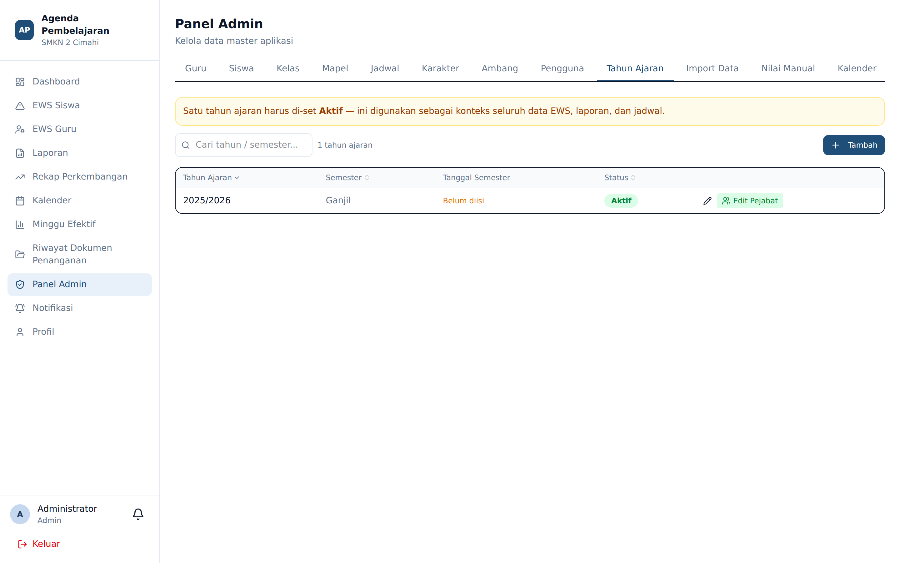
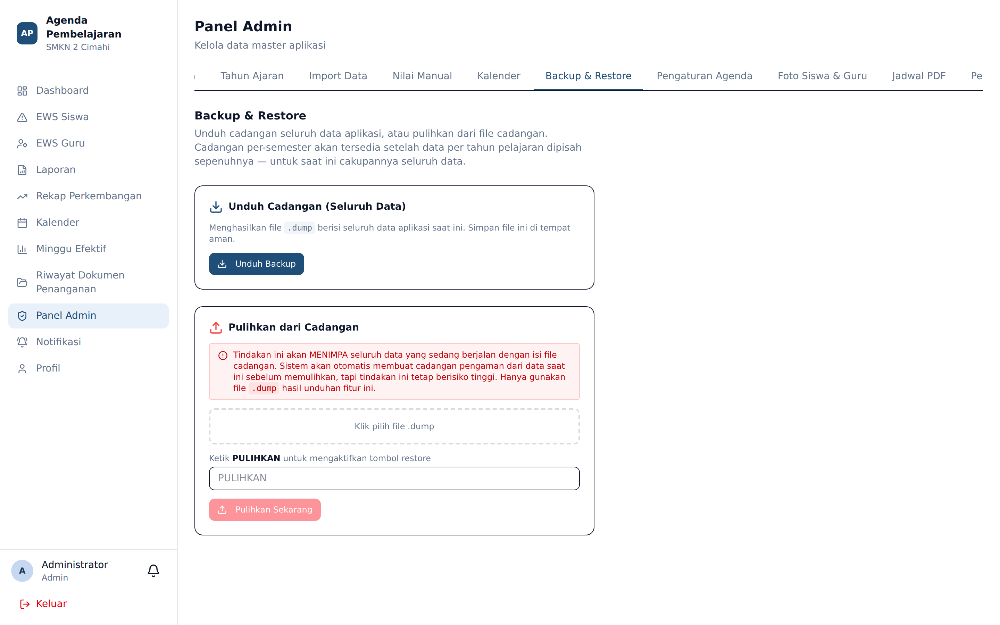
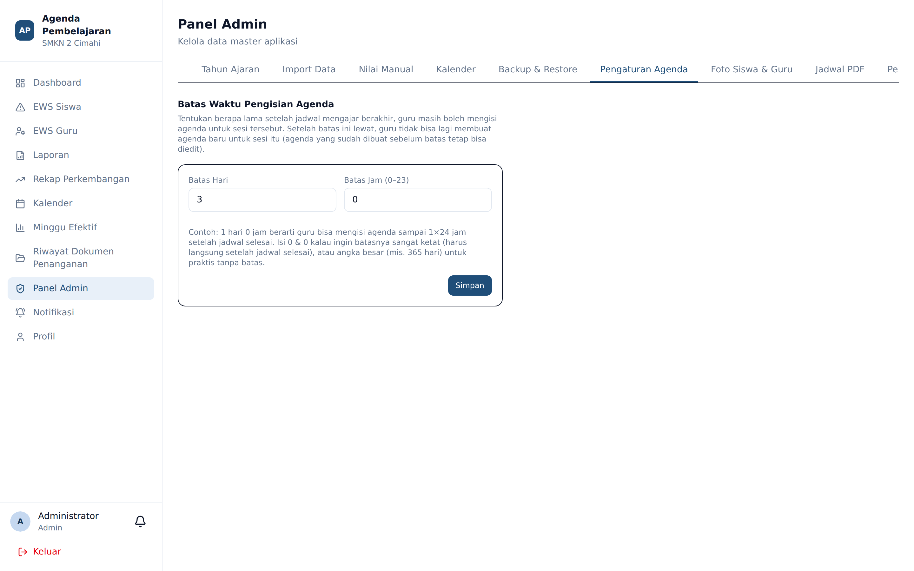

# Tahun Ajaran, Backup, dan Pengaturan Agenda

**Siapa yang memakai:** Admin
**Menu:** Panel Admin → tab **Tahun Ajaran**, **Backup & Restore**, **Pengaturan Agenda**

## Tab Tahun Ajaran

Tahun ajaran adalah wadah bagi seluruh data: kelas, jadwal, agenda, presensi, poin karakter,
dan EWS. Setiap tahun ajaran memuat **tahun** (misalnya `2025/2026`) dan **semester**
(Ganjil atau Genap).

Yang dapat diatur:

- Membuat tahun ajaran baru. **Tidak ada batas jumlah** tahun ajaran.
- Menetapkan satu tahun ajaran sebagai **aktif**.
- Menyunting **tanggal mulai** dan **tanggal selesai** semester secara dinamis.

⚠️ Tanggal mulai dan selesai semester menentukan perhitungan hari efektif. Hari di luar rentang
itu tidak pernah dihitung, betapapun sudah ditandai. Bila hitungan minggu efektif terasa
janggal, periksa rentang tanggal semester lebih dahulu.

Pengguna memilih tahun ajaran yang akan dikerjakan saat masuk, dan dapat berpindah kapan saja
melalui halaman **Pilih Tahun Ajaran**.

## Tab Backup & Restore

- **Backup** — mengunduh cadangan basis data.
- **Restore** — memulihkan basis data dari berkas cadangan.

⚠️ **Restore menimpa seluruh data yang ada.** Selalu lakukan backup terlebih dahulu, dan pastikan
Anda benar-benar tahu isi berkas yang akan dipulihkan. Operasi ini tidak dapat dibatalkan.

💡 Lakukan backup rutin sebelum tindakan berisiko: impor massal, pergantian tahun ajaran, atau
pembaruan aplikasi.

## Tab Pengaturan Agenda

Menetapkan **batas waktu pengisian agenda**: berapa hari dan sampai jam berapa setelah sesi
berlangsung, seorang guru masih boleh membuat agenda baru.

Perilaku yang perlu dipahami:

| Tindakan | Terpengaruh batas waktu? |
|---|---|
| Membuat agenda baru | **Ya** — ditolak bila lewat batas |
| Menyunting agenda yang sudah tersimpan | **Tidak** — selalu diizinkan |
| Mengisi agenda untuk tanggal masa depan | Selalu ditolak |

Sesi yang lewat batas tanpa agenda dihitung **Kosong** pada EWS Guru.

💡 Batas yang terlalu ketat membuat guru frustrasi; batas yang terlalu longgar membuat data
agenda kehilangan makna sebagai catatan harian. Sekolah umumnya menetapkan 2–3 hari.
