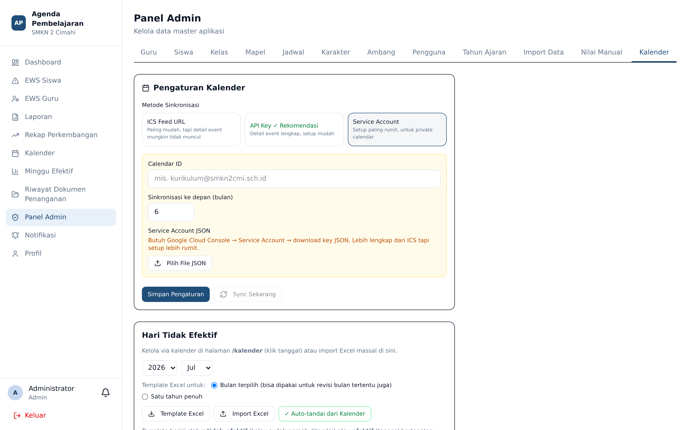
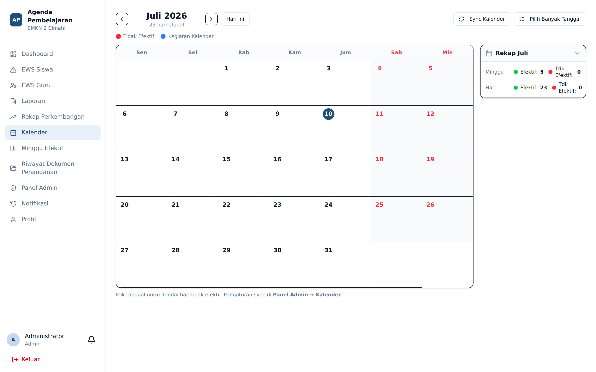
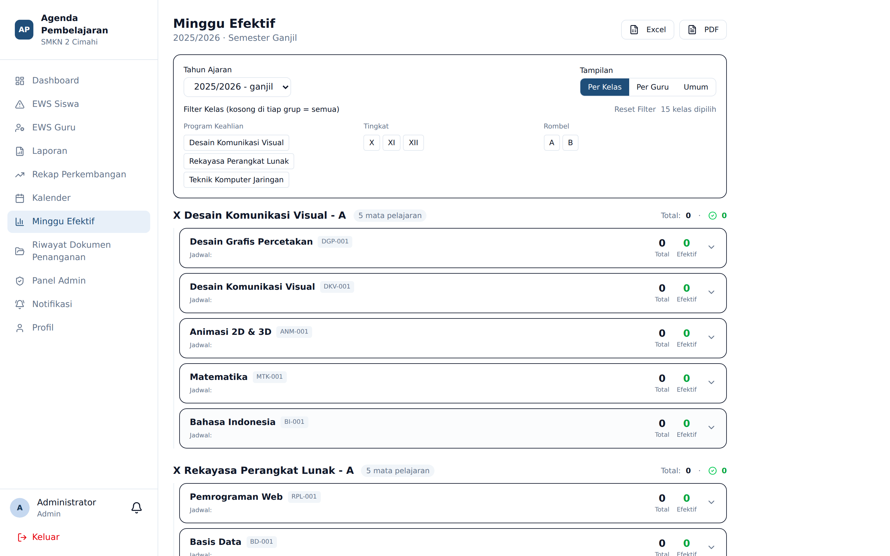

# Kalender dan Minggu Efektif

**Siapa yang memakai:** Admin, Wakasek
**Menu:** Kalender, Minggu Efektif, dan Panel Admin → tab **Kalender**

## Tab Kalender di Panel Admin

Tab ini mengatur sumber data kalender dan daftar hari tidak efektif.

### Tiga Cara Mengisi Kalender

| Cara | Cocok bila |
|---|---|
| **Google Calendar API Key** | Sekolah memiliki kalender publik di Google Calendar |
| **Berkas ICS** | Kalender diekspor sebagai berkas `.ics` |
| **Import Excel** | Daftar hari libur disusun manual dalam spreadsheet |

Metode yang saat ini dipakai adalah **API Key**. Kunci disimpan terenkripsi; kolom yang
dikosongkan berarti *jangan ubah nilai lama*.

### Menandai Hari Tidak Efektif

1. Buka menu **Kalender**.
2. Klik tanggal yang ingin ditandai.
3. Formulir penandaan muncul. Bila ada acara Google Calendar pada tanggal itu, keterangan
   terisi otomatis dari nama acaranya — Anda juga dapat mengklik nama acara untuk menyalinnya.
4. Simpan.

⚠️ **Sinkronisasi kalender tidak otomatis menjadikan sebuah tanggal sebagai hari tidak efektif.**
Acara di Google Calendar hanyalah informasi. Penandaan tetap tindakan sadar Admin. Ini disengaja:
tidak semua acara sekolah meniadakan pembelajaran.

Tersedia pula tombol **tandai otomatis** untuk memberi tanda massal berdasarkan daftar acara,
serta **Import Excel** untuk memasukkan daftar hari libur sekaligus.

## Minggu Efektif

Aturan perhitungan:

- Hanya dihitung **di dalam rentang tanggal semester aktif**.
- **Sabtu dan Minggu** tidak pernah efektif.
- Satu minggu dihitung **efektif** bila memuat **≥ 3 hari efektif**.
- Hari yang ditandai tidak efektif dikurangkan.

Halaman menyediakan penyaring per **kelas** dan per **guru**, pemilihan banyak tanggal sekaligus,
serta kolom **Keterangan**.

### Mencetak

| Keluaran | Batas | Kapan dipakai |
|---|---|---|
| **PDF** | Maksimal 40 lembar sekali cetak | Dokumen yang akan ditandatangani |
| **Excel** | Tanpa batas praktis | Rekap massal seluruh kelas atau guru |

Tekan **Pengaturan Cetak** untuk mengatur kertas, margin, dan kop; pratinjau ditampilkan sebelum
berkas diunduh.

⚠️ Batas 40 lembar pada PDF disengaja. Permintaan cetak yang jauh lebih besar akan gagal di
tengah jalan; gunakan Excel untuk kebutuhan massal.
