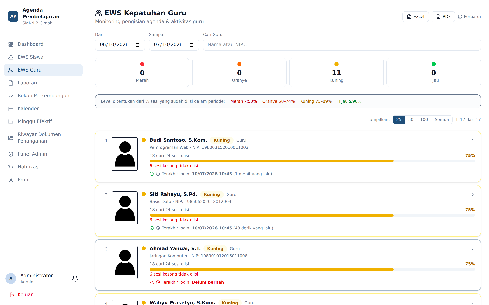
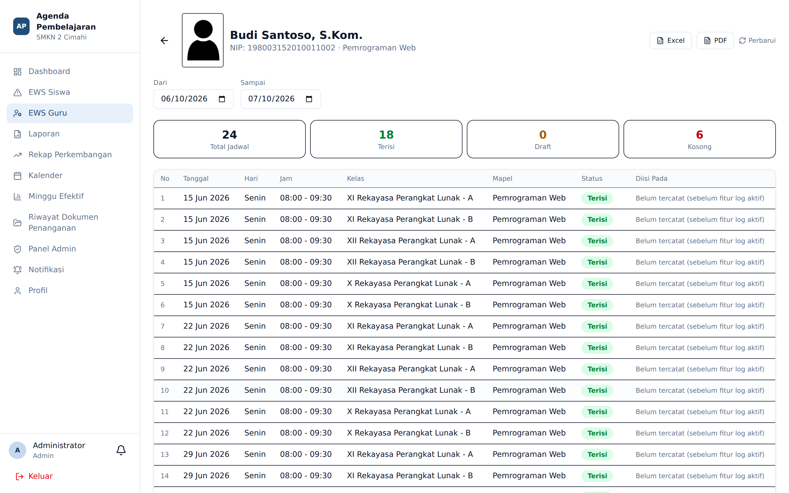
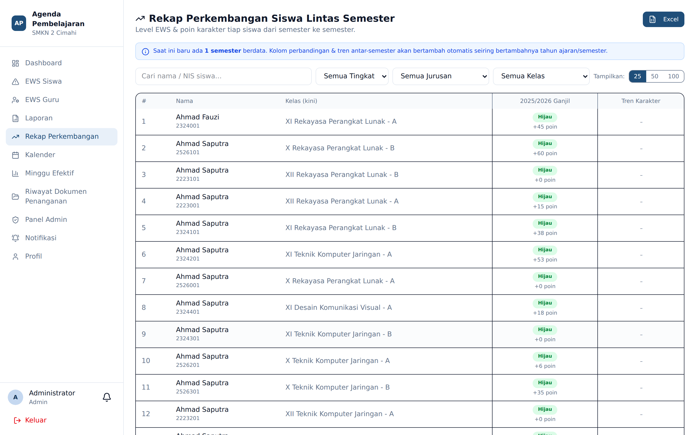

# EWS Guru dan Rekap Perkembangan

**Siapa yang memakai:** Admin, Wakasek
**Menu:** EWS Guru, Rekap Perkembangan

## EWS Guru

Sementara EWS Siswa memantau siswa, **EWS Guru** memantau kepatuhan pengisian agenda. Halaman ini
menampilkan, untuk rentang tanggal tertentu, berapa banyak jadwal tiap guru yang sudah **Terisi**,
masih **Draft**, dan masih **Kosong**.

Bawaannya menampilkan **30 hari terakhir**. Rentang tanggal bersifat opsional — bila dikosongkan,
sistem memakai bawaan tersebut.

### Grafik Ringkas Pengisian Agenda

Di bagian atas halaman terdapat dua panel grafik yang merangkum keadaan seluruh sekolah pada
rentang tanggal terpilih (tidak terpengaruh pencarian/penyaring guru):

- **Pengisian Agenda Sekolah** — persentase besar total sesi yang sudah terisi, disertai batang
  komposisi **Tersubmit / Draft / Kosong** dan angka masing-masing.
- **Sebaran Status Guru** — jumlah guru terjadwal dan batang proporsi tingkat **Merah / Oranye /
  Kuning / Hijau**.

Di bawah grafik, empat kotak angka per tingkat sekaligus berfungsi sebagai **penyaring**: klik
salah satu untuk hanya menampilkan guru pada tingkat itu. Tingkat ditentukan dari persentase sesi
yang sudah diisi: **Merah <50%**, **Oranye 50–74%**, **Kuning 75–89%**, **Hijau ≥90%**.

## Detail per Guru

Klik nama guru untuk membuka rincian sesinya.

Layar detail menampilkan:

- Empat kartu ringkasan: Total Jadwal, Terisi, Draft, Kosong.
- Tabel setiap sesi: tanggal, hari, jam, kelas, mata pelajaran, status, dan **kapan agenda diisi**.
- Tombol **Excel** dan **PDF** untuk mengekspor rincian, serta **Perbarui** untuk menghitung ulang.

Kolom *Diisi Pada* berasal dari **log audit**. Sistem mencatat waktu dan alamat IP setiap kali
agenda dibuat atau diubah.

⚠️ Log audit agenda baru mulai dicatat sejak fitur ini diaktifkan. Agenda yang dibuat sebelumnya
menampilkan keterangan *"Belum tercatat (sebelum fitur log aktif)"* — itu bukan kesalahan.

## Membaca Angka dengan Adil

Sebelum menyimpulkan seorang guru lalai, periksa tiga hal:

1. **Jadwal** — apakah sesi itu memang miliknya? Jadwal yang keliru menuduh guru yang salah.
2. **Guru Inval** — apakah sesi itu sudah dialihkan dan **disetujui** guru pengganti? Bila ya,
   kewajiban berpindah. Pengajuan yang belum disetujui tidak memindahkan apa pun.
3. **Hari tidak efektif** — apakah tanggal itu memang hari pembelajaran?

## Rekap Perkembangan Lintas Semester

Halaman ini membandingkan perkembangan siswa **antar semester**, bukan di dalam satu semester.
Datanya bersumber dari status EWS yang tersimpan per tahun ajaran, dicocokkan berdasarkan **NIS**
sehingga tetap terlacak meski siswa naik kelas.

Isinya mencakup tren poin karakter dan perubahan tingkat EWS dari waktu ke waktu, serta dapat
diekspor ke Excel.

Halaman ini hanya dapat diakses **Admin dan Wakasek**.
