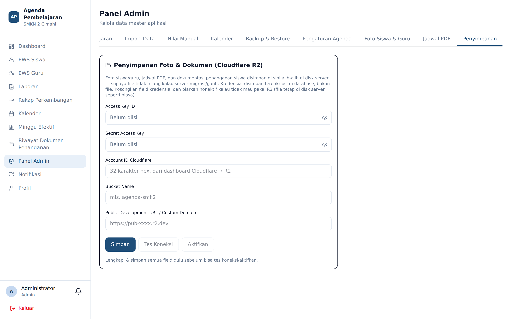
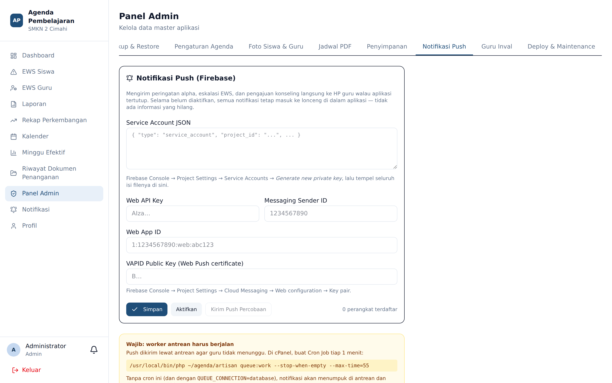
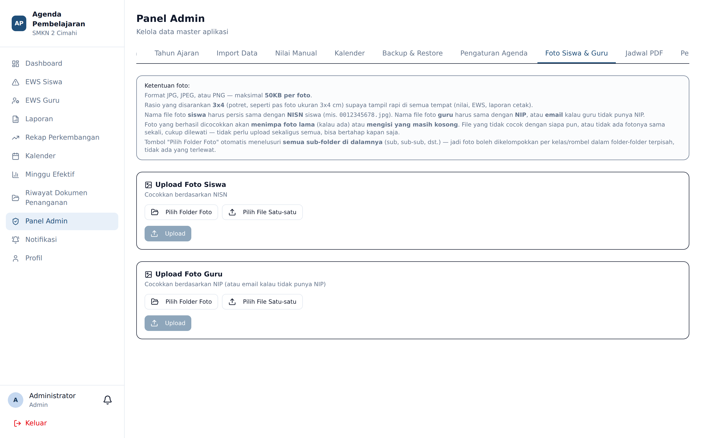
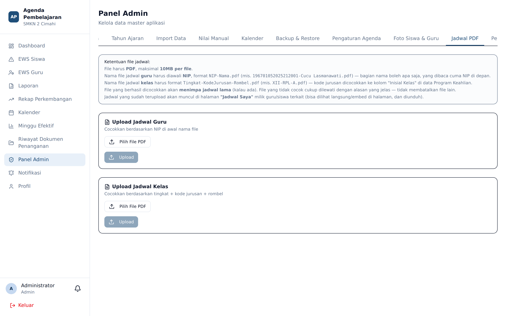
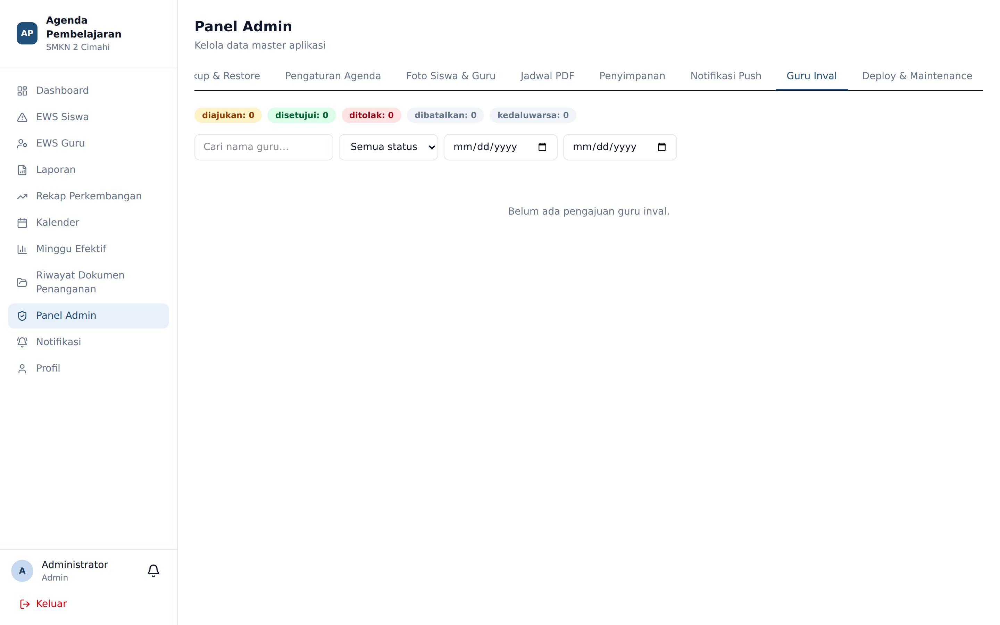

# Penyimpanan, Notifikasi Push, Foto, dan Jadwal PDF

**Siapa yang memakai:** Admin
**Menu:** Panel Admin → tab **Penyimpanan**, **Notifikasi Push**, **Foto Siswa & Guru**, **Jadwal PDF**

## Tab Penyimpanan (Cloudflare R2)

Secara bawaan, foto dan dokumen disimpan di cakram peladen. Bila ruang peladen terbatas, Admin
dapat memindahkannya ke **Cloudflare R2**.

1. Isi kredensial R2. Kredensial disimpan **terenkripsi** dan ditampilkan tersamar.
2. Tekan **Tes Koneksi** sebelum menyalakan. Jangan mengaktifkan sebelum tes berhasil.
3. Nyalakan sakelar aktif.

Aturan penting:

- Kolom kredensial yang **dikosongkan berarti "jangan ubah"**, bukan "kosongkan nilainya".
- Pengaturan ini dilakukan dari Panel Admin, **bukan** dari berkas `.env`.
- Pilihan aktif berlaku juga di lingkungan pengembangan lokal, bukan hanya produksi.

## Tab Notifikasi Push (Firebase)

Mengatur kredensial Firebase Cloud Messaging yang dipakai mengirim notifikasi push ke peramban
dan telepon pengguna.

Setelah dikonfigurasi, tiap pengguna mengatur sendiri jenis notifikasi yang ia terima melalui
menu **Notifikasi** pada akunnya masing-masing.

Ingat bahwa izin notifikasi diberikan oleh peramban pengguna. Pengguna yang pernah menekan
**Blokir** harus memulihkannya dari pengaturan situs peramban — Admin tidak dapat memaksanya.

## Tab Foto Siswa & Guru

Mengunggah foto secara **massal** melalui berkas ZIP, atau **satuan** per orang. Foto dikompresi
otomatis saat diunggah.

Nama berkas di dalam ZIP harus sesuai dengan pengenal yang diminta pada layar (umumnya NIS untuk
siswa dan NIP untuk guru).

## Tab Jadwal PDF

Mengunggah berkas jadwal resmi dalam bentuk PDF, per kelas. Setelah diunggah, guru dan siswa
dapat mengunduhnya melalui menu **Jadwal Saya** masing-masing.

## Tab Guru Inval

Memantau seluruh pengajuan guru pengganti di sekolah: siapa mengajukan, kepada siapa, sesi mana,
alasannya, dan statusnya. Berguna untuk menengahi ketika ada perselisihan soal siapa yang
seharusnya mengisi agenda sebuah sesi.
