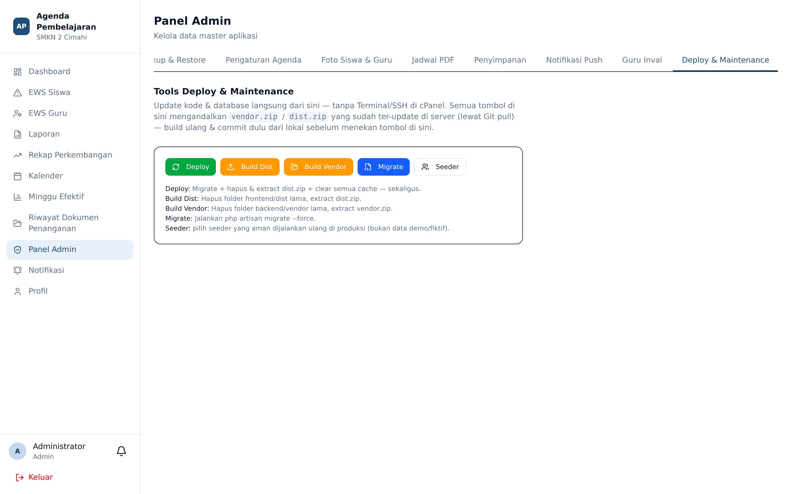

# Deploy & Maintenance

**Siapa yang memakai:** Admin
**Menu:** Panel Admin → tab **Deploy & Maintenance**

## Untuk Apa Tab Ini Ada

Peladen produksi sekolah berjalan di **cPanel**, yang tidak menyediakan akses Terminal. Tab ini
memindahkan perintah pemeliharaan yang biasanya dijalankan lewat baris perintah ke dalam antarmuka
web, sehingga Admin dapat merawat aplikasi tanpa akses SSH.

## Tindakan yang Tersedia

| Tindakan | Kegunaan |
|---|---|
| Jalankan migrasi basis data | Menerapkan perubahan struktur tabel setelah pembaruan aplikasi |
| Bersihkan cache | Menghapus cache konfigurasi, rute, dan tampilan |
| Tautkan penyimpanan | Membuat symlink `storage` agar berkas unggahan dapat diakses |
| Periksa kesehatan sistem | Memeriksa koneksi basis data, cache, antrean, dan penyimpanan |

## Urutan Setelah Pembaruan Aplikasi

1. **Backup** basis data terlebih dahulu (tab **Backup & Restore**).
2. Jalankan **migrasi basis data**.
3. **Bersihkan cache**.
4. **Periksa kesehatan sistem**.
5. Masuk sebagai satu akun dari tiap peran dan pastikan dashboard terbuka normal.

⚠️ Jangan pernah menjalankan migrasi tanpa backup. Migrasi yang gagal di tengah jalan dapat
meninggalkan basis data dalam keadaan tak konsisten.

## Catatan Lingkungan cPanel

Pada cPanel, aplikasi berjalan dengan basis data **MySQL** dan antrean bermodus **sync**
(pekerjaan dijalankan langsung, bukan lewat pekerja latar). Karena itu beberapa operasi berat
seperti ekspor PDF berjumlah besar terasa lebih lambat dibandingkan lingkungan pengembangan.

Ini alasan lain mengapa ekspor PDF Minggu Efektif dibatasi 40 lembar dan ekspor massal diarahkan
ke Excel.

## Jika Aplikasi Menampilkan Layar Putih Kosong

Layar putih total berarti antarmuka mengalami kegagalan. Aplikasi memasang dua lapis penangkap
kesalahan sehingga hal ini semestinya jarang terjadi — sidebar tetap tampil dan berpindah menu
akan memulihkan halaman.

Bila layar tetap putih:

1. Muat ulang halaman.
2. Bersihkan cache melalui tab **Deploy & Maintenance**.
3. Periksa apakah ada data hasil impor yang tidak lengkap, misalnya jadwal tanpa kelas atau siswa
   tanpa kelompok. Data yatim semacam itu adalah penyebab kegagalan yang paling sering.
