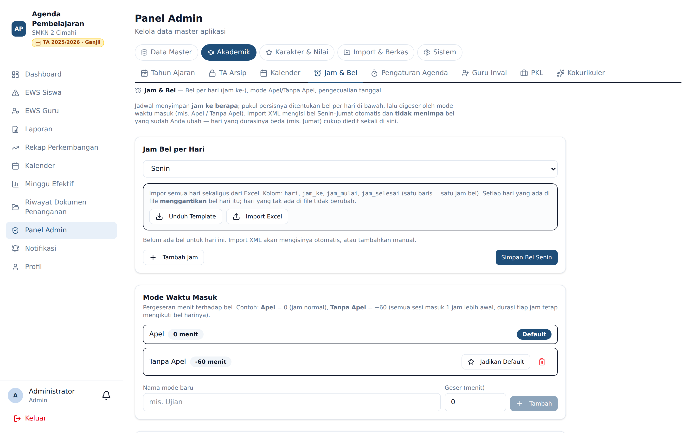

# Jam & Bel

**Siapa yang memakai:** Admin
**Menu:** Panel Admin → grup **Akademik** → **Jam & Bel**

Menu ini mengatur **pukul berapa** setiap jam pelajaran berlangsung. Jadwal hanya menyimpan *jam
ke berapa* sebuah sesi; pukul persisnya ditentukan di sini, lalu bisa digeser oleh **mode waktu
masuk** (mis. hari Apel / Tanpa Apel).

## Jam Bel per Hari

Pilih hari, lalu tetapkan daftar **Jam ke- → pukul mulai s.d. pukul selesai**. Ini memungkinkan
durasi berbeda antar hari (mis. Jumat lebih pendek). Tekan **Tambah Jam** untuk menambah baris dan
**Simpan Bel** untuk menyimpan hari tersebut.

## Impor Jam Bel dari Excel

Untuk mengisi banyak hari sekaligus, gunakan kotak **impor** di bagian atas:

1. Tekan **Unduh Template** untuk mendapatkan berkas contoh dengan kolom
   `hari`, `jam_ke`, `jam_mulai`, `jam_selesai` (satu baris = satu jam bel).
2. Isi/ubah berkas itu, lalu tekan **Import Excel** dan pilih berkasnya.

⚠️ Setiap **hari** yang muncul di berkas akan **menggantikan** seluruh bel hari itu; hari yang
tidak ada di berkas tidak berubah. Jadi Anda boleh mengimpor sebagian hari saja.

Setelah impor, aplikasi menampilkan berapa baris berhasil dan — bila ada — daftar baris yang
gagal beserta alasannya (mis. nama hari salah, jam ke- di luar 0–20, format waktu keliru, atau
jam selesai lebih awal dari jam mulai).

## Mode Waktu Masuk (Apel / Tanpa Apel)

Mode menggeser seluruh jam masuk sekian menit tanpa mengubah durasi tiap jam. Contoh: **Apel** =
0 menit (jam normal), **Tanpa Apel** = −60 menit (semua sesi masuk 1 jam lebih awal).

- Anda dapat menetapkan **mode default per hari**.
- Untuk kejadian khusus, buat **pengecualian per tanggal** yang mengalahkan default hari maupun
  global.

Perubahan jam & bel langsung dipakai untuk menghitung jam sesi, tenggat pengisian agenda, dan
laporan.
