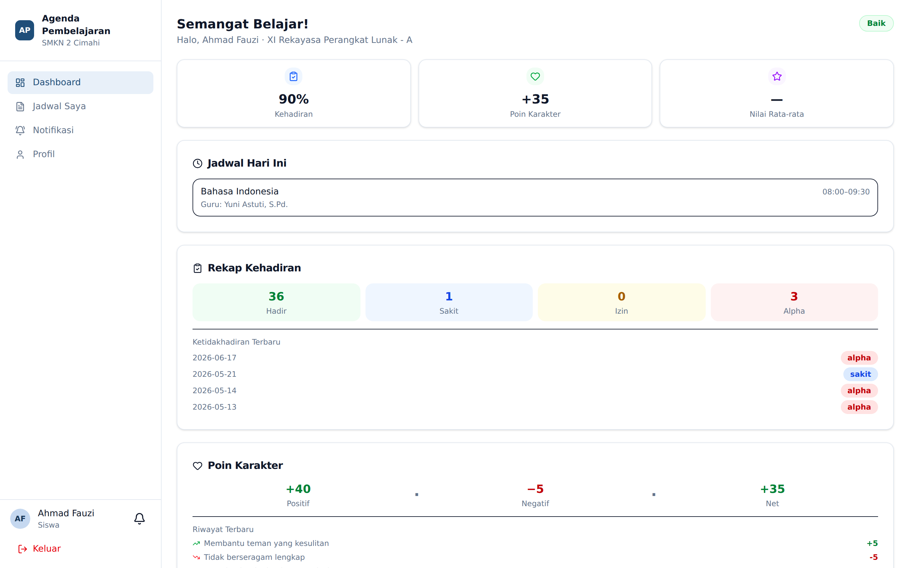
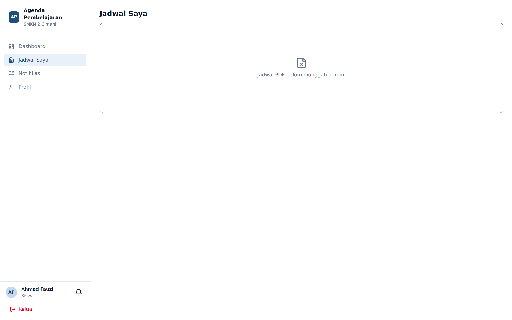

# Panduan Siswa dan Orang Tua

## Siswa

### Masuk

Siswa dapat masuk memakai **NISN** atau alamat surel, lalu memilih semester.

### Dashboard

Menampilkan:

- Rekap kehadiran pribadi
- Poin karakter terkini beserta riwayat pemberiannya
- Jadwal pelajaran hari ini

### Jadwal Saya

Jadwal pelajaran satu pekan penuh. Bila sekolah telah mengunggah berkas jadwal resmi, tersedia
tombol unduh PDF.

### Notifikasi

Siswa dapat mengatur notifikasinya sendiri melalui menu **Notifikasi**, termasuk menyalakan jam
tenang.

### Yang Tidak Dapat Dilakukan Siswa

Siswa tidak dapat melihat data siswa lain, tidak dapat melihat halaman EWS, dan tidak dapat
mengubah nilai atau poin karakternya sendiri.

## Orang Tua

Akun orang tua dibuat Admin dan ditautkan ke satu siswa.

Orang tua hanya memiliki **Dashboard**, **Notifikasi**, dan **Profil**. Dashboard menampilkan
perkembangan anak: kehadiran, poin karakter, dan tingkat peringatan bila ada.

Notifikasi berguna agar orang tua mengetahui lebih awal ketika anaknya memasuki tingkat
peringatan tertentu, sebelum masalah membesar.

## Menjaga Keamanan Akun

- Ganti kata sandi bawaan segera setelah masuk pertama kali, melalui menu **Profil**.
- Jangan membagikan kata sandi kepada siapa pun, termasuk teman sekelas.
- Bila lupa kata sandi, gunakan tautan **Lupa password?** pada halaman masuk, atau hubungi
  wali kelas untuk diteruskan kepada Admin.
